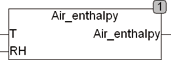

<!--
  Copyright (c) 2026 Hans Mühlbauer, Franz Höpfinger and others.

  This program and the accompanying materials are made available under the
  terms of the Eclipse Public License 2.0 which is available at
  https://www.eclipse.org/legal/epl-2.0

  SPDX-License-Identifier: EPL-2.0
-->

## Type	Funktion : REAL

| | |
|:---|:---|
| **Input	T** | REAL (Temperatur der Luft) |
| **RH** | REAL (Relative Feuchte der Luft) |
| **Output** | (Enthalpie der Luft in J/g) |
| | AIR_ENTHALPY berechnet die Enthalpie von Feuchter Luft aus den Angaben T für Temperatur in Grad Celsius und der relativen Feuchte RH in % (50 = 50%). Die Enthalpie wird in Joule / Gramm berechnet. |

