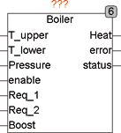

<!--
  Copyright (c) 2026 Hans Mühlbauer, Franz Höpfinger and others.

  This program and the accompanying materials are made available under the
  terms of the Eclipse Public License 2.0 which is available at
  https://www.eclipse.org/legal/epl-2.0

  SPDX-License-Identifier: EPL-2.0
-->

## BOILER

| | | |
|:---|:---|:---|
| **Type** | Funktionsbaustein | |
| **Input	T_UPPER** | REAL (Eingang oberer Temperatursensor) | |
| **T_LOWER** | REAL (Eingang unterer Temperatursensor) | |
| **PRESSURE** | REAL (Eingang Drucksensor) | |
| **ENABLE** | BOOL (Warmwasseranforderung) | |
| **REQ_1** | BOOL (Anforderungseingang für vordefinierte | Temperatur 1) |
| **REQ_2** | BOOL (Anforderungseingang für vordefinierte | Temperatur 2) |
| **BOOST** | BOOL (Anforderungseingang für sofortige | |
| | Bereitstellung) | |
| **Output	HEAT** | BOOL (Ausgang für Ladekreis) | |
| **ERROR** | BOOL (Fehlersignal) | |
| **STATUS** | Byte (ESR kompatibler Status Ausgang) | |
| **Setup	T_UPPER_MIN** | REAL (Mindesttemperatur für oben) | |
| | Default = 50 | |
| **T_UPPER_MAX** | REAL (Maximaltemperatur für oben) | |
| | Default = 60 | |
| **T_LOWER_ENABLE** | BOOL (FALSE, wenn unterer | Temperatursensor nicht vorhanden ist) |
| **T_LOWER_MAX** | REAL (Maximaltemperatur des unten) | |
| | Default = 60 | |
| **T_REQUEST_1** | REAL (Temperatur bei Anforderung 1) | |
| | Default = 70 | |
| **T_REQUEST_2** | REAL(Temperatur bei Anforderung 2) | |
| | Default = 50 | |
| **T_REQUEST_HYS** | REAL (Hysterese für Regelung) Default = 5 | |
| **T_PROTECT_HIGH** | REAL (obere Grenztemperatur, | |
| | Default = 80) | |
| **T_PROTECT_LOW** | REAL (untere Grenztemperatur, | |
| | Default = 10) | |
| | BOILER ist ein Controllerfür Pufferspeicher wie etwa Warmwasserspeicher. Durch 2 separate Temperatursensor-Eingänge können auch Schichtenspeicher geregelt werden. Mit der Setup-Variable  T_LOWER_ENABLE kann der untere Temperatursensor aus- und eingeschaltet werden. Wenn der Eingang ENABLE auf TRUE ist, wird der Boiler aufgeheizt (HEAT = TRUE) bis die Vorgabetemperatur T_LOWER_MAX im unteren Bereich des Puffers erreicht ist und dann die Heizung ausgeschaltet, bis die untere Grenztemperatur des oberen Bereichs (T_UPPER_MIN) erreicht wird. Falls T_LOWER_ENABLE auf FALSE ist, wird der untere Sensor nicht ausgewertet und die Temperatur zwischen T_UPPER_MIN und T_UPPER_MAX im oberen Bereich geregelt. Ein PRESSURE-Eingang schützt den Boiler und verhindert die Ladung, wenn nicht genügend Wasserdruck im Boiler vorhanden ist. Falls ein Drucksensor nicht vorhanden ist, bleibt der Eingang unbeschaltet. Als weitere Schutzfunktion stehen die Vorgabewerte T_PROTECT_LOW (Frostschutz) und T_PROTECT_HIGH zur Verfügung und verhindern das die Temperatur im Puffer einen oberen Grenzwert nicht übersteigt und ein unterer Grenzwert nicht unterschritten wird. Bei Auftreten eines Fehlers wird der Ausgang ERROR auf TRUE gesetzt und gleichzeitig ein Statusbyte am Ausgang Status gemeldet, welches durch Bausteine wie ESR_COLLECT weiter ausgewertet werden kann. Durch eine steigende Flanke am Eingang BOOST wird die Puffertemperatur unmittelbar auf T_UPPER_MAX (T_LOWER_ENABLE = FALSE) beziehungsweise T_LOWER_MAX (T_LOWER_ENABLE = TRUE) aufgeheizt. BOOST kann zur außerplanmäßigen Aufheizung des Boilers, wenn ENABLE auf FALSE ist, benutzt werden. Die Aufheizung durch BOOST ist flankengetriggert und führt bei jeder steigenden Flanke an BOOST zu genau einem Aufheizvorgang. Durch eine steigende Flanke an BOOST während ENABLE TRUE ist wird die Heizung sofort gestartet bis die maximale Temperatur erreicht ist. Der Boiler wird also nachgeladen, um maximale Wärmekapazität bereitzustellen. Die Eingänge REQ_1 und REQ_2 dienen dazu, jederzeit eine vordefinierte Temperatur (T_REQUEST_1 oder T_REQUEST_2) bereitzustellen. REQ kann zum Beispiel zur Bereitstellung einer höheren Temperatur zur Legionellendesinfektion oder auch zu anderen Zwecken verwendet werden. Die Bereitstellung der Request-Temperaturen erfolgt durch Messung am oberen Temperatursensor und mit einer 2-Punkt Regelung deren Hysterese durch T_REQUEST_HYS voreingestellt wird. | |
| **Das folgende Beispiel zeigt die Anwendung von BOILER mit einem TIMER und einer Feiertagsschaltung** |  | |

| Status |  |
| --- | --- |
| 1 | oberer Temperatursensor hat die obere Grenztemperatur überschritten |
| 2 | oberer Temperatursensor hat die untere Grenztemperatur unterschritten |
| 3 | unterer Temperatursensor hat die obere Grenztemperatur überschritten |
| 4 | unterer Temperatursensor hat die untere Grenztemperatur unterschritten |
| 5 | Wasserdruck im Puffer ist zu gering |
| 100 | Standby |
| 101 | BOOST Nachladung |
| 102 | Standard Nachladung |
| 103 | Nachladung auf Request Temperatur 1 |
| 104 | Nachladung auf Request Temperatur 2 |
