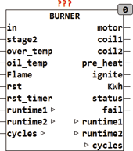
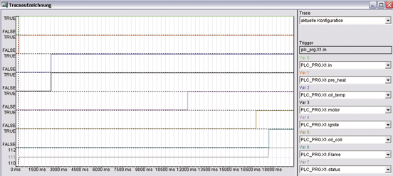
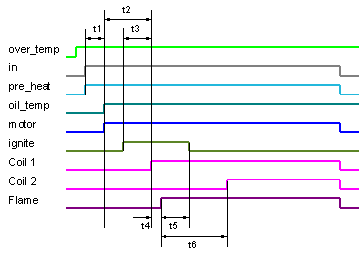

<!--
  Copyright (c) 2026 Hans Mühlbauer, Franz Höpfinger and others.

  This program and the accompanying materials are made available under the
  terms of the Eclipse Public License 2.0 which is available at
  https://www.eclipse.org/legal/epl-2.0

  SPDX-License-Identifier: EPL-2.0
-->

## Type	Funktionsbaustein

| | |
|:---|:---|
| **Input	IN** | BOOL (Steuereingang) |
| **STAGE2** | BOOL (Steuereingang Stufe 2) |
| **OVER_TEMP** | BOOL (Temperaturbegrenzung des Kessels) |
| **OIL_TEMP** | BOOL (Thermostat der Ölvorerwärmung) |
| **FLAME** | BOOL (Flammwächter) |
| **RST** | BOOL (Reset-Eingang Für Störrücksetzung) |
| **RST_TIMER** | BOOL (Reset für die Betriebszähler) |
| **Output	MOTOR** | BOOL (Steuersignal für den Motor) |
| **COIL1** | BOOL (Steuersignal für Ölventil Stufe 1) |
| **COIL2** | BOOL (Steuereingang für Ölventil Stufe 2) |
| **PRE_HEAT** | BOOL (Ölvorerwärmung) |
| **IGNITE** | BOOL (Zündung) |
| **KWH** | REAL (Kilowattstundenzähler) |
| **STATUS** | Byte (ESR Kompatibler Statusausgang) |
| **FAIL** | BOOL (Störmeldung: TRUE, wenn Fehler Auftritt) |
| **I/O	RUNTIME1** | UDINT (Betriebszeit Stufe 1) |
| **RUNTIME2** | UDINT (Betriebszeit Stufe 2) |
| **CYCLES** | UDINT (Anzahl der Brenner Starts) |
| **Setup	PRE_HEAT_TIME** | TIME (maximale Zeit für die |
| | Ölvorerwärmung) |
| **PRE_VENT_TIME** | TIME (Vorbelüftungszeit) |
| **PRE_IGNITE_TIME** | TIME (Vorzündungszeit) |
| **POST_IGNITE_TIME** | TIME (Nachzündungszeit) |
| **STAGE2_DELAY** | TIME (Verzögerung Stufe 2) |
| **SAFETY_TIME** | TIME () |
| **LOCKOUT_TIME** | TIME (Zeit die vergehen muss, bevor mit |
| | einem RST eine Störung gelöscht werden kann) |
| **MULTIPLE_IGNITION** | BOOL () |
| **KW1** | REAL (Leistung des Brenners auf Stufe 1 in KW) |
| **KW2** | REAL (Leistung des Brenners auf Stufe 2 in KW) |
| | BURNER ist ein Steuerinterface für Öl- oder Gasbrenner mit Betriebszähler und Kilowattstundenzähler. Der Baustein steuert einen zweistufigen Brenner mit optionaler Ölvorerwärmung. Der Eingang IN ist der Steuereingang, der den Brenner nur dann startet, wenn der Eingang OVER_TEMP FALSE ist. OVER_TEMP ist der Kesselschutzthermostat, der TRUE wird, wenn die Kesseltemperatur die maximal zulässige Temperatur erreicht hat. Ein Brennerstart beginnt mit der Ölvorerwärmung, indem PRE_HEAT TRUE wird. Dann wird auf ein Signal am Eingang OIL_TEMP gewartet. Falls innerhalb der PRE_HEAT_TIME das Signal OIL_TEMP nicht TRUE wird und die Öltemperatur nicht erreicht wird, wird die Startsequenz unterbrochen und der Ausgang Störung gesetzt. Gleichzeitig wird am Ausgang Status Der Fehler 1 ausgegeben. Nach der Ölvorerwärmung wird der Motor eingeschaltet und damit der Ventilator in Betrieb gesetzt. Anschließend wird nach definierter Zeit die Zündung eingeschaltet und danach das Ölventil geöffnet. Sollte dann nach spezifizierter Zeit (SAFETY_TIME) der Flammwächter nicht ansprechen, so geht der Baustein auf Störung. Eine Störung wird auch dann signalisiert, wenn der Flammwächter bereits vor der Zündung anspricht. Falls nach erfolgreicher Zündung die Flamme abreißt und die Setup-Variable MULTIPLE_IGNITION = TRUE steht, wird sofort wieder gezündet. Eine zweite Stufe wird nach Ablauf der STAGE2_DELAY Zeit automatisch zugeschaltet wenn der Eingang STAGE2 TRUE ist. |
| | Tritt eine Störung auf, so wird der Baustein für eine feste Zeit LOCKOUT_TIME blockiert und erst danach kann ein RST den Betrieb wieder starten. Während der LOCKOUT_TIME muss der RST-Eingang FALSE sein. Ein TRUE am Eingang OVER_TEMP stoppt sofort jede Aktion und meldet den Fehler 9. |
| **Der Status-Ausgang signalisiert den momentanen Zustand des Bausteins** |  |
| | 110 = Warten auf Startsignal (Standby) 111 = Startsequenz wird durchlaufen 112 = Brenner Läuft auf Stufe 1 113 = Brenner läuft auf Stufe 2 |
| **Eine Reihe von Fehlerzuständen werden am Ausgang STATUS bereitgestellt, wenn ein Fehler Auftritt** |  |
| | 1 = Ölvorerwärmung hat innerhalb der PRE_HEAT_TIME nicht angesprochen 2 = Flammwächter ist aktiv während der Ölvorerwärmung (PRE_HEAT_TIME) 3 = Flammwächter ist aktiv während der Belüftungszeit (PRE_VENTILATION_TIME) 4 = Sicherheitszeit (Safety_TIME) wurde ohne Flamme überschritten 5 = Flamme ist im Betrieb Abgerissen 9 = Kessel Übertemperatur Kontakt hat Ausgelöst |
| **Traceaufzeichnung einer Normalen Startsequenz** |  |
| | Das Signal IN startet die Sequenz mit dem Ausgang PRE_HEAT. Nach erreichen der Öltemperatur (OIL_TEMP = TRUE) wird der Motor gestartet und die PRE_VENTILATION_TIME (Zeit von Motor Start bis Ölventil offen ist) abgewartet. Nach einer einstellbaren Zeit (PPR_IGNITION_TIME) vor dem Öffnen des Ölventils wird die Zündung eingeschaltet. Die Zündung bleibt dann solange ein, bis die POST_IGNITION_TIME abgelaufen ist. Die Betriebszeit wird je Stufe unabhängig in Sekunden gemessen. |
| **Das folgende Zeitdiagramm erläutert die verschiedenen Setup-Zeiten und den Ablauf** |  |
| **Das Zeitdiagramm gibt den genauen Zeitverlauf wieder** |  |
| | t1 = Vorheizzeit (PRE_HEAT_TIME) |
| | t2 = Vorbelüftungszeit (PRE_VENT_TIME) |
| | t3 = Vorzündungszeit (PRE_IGNITE_TIME) |
| | t4 = Sicherheitszeit (SAFETY_TIME) |
| | t5 = Nachzündungszeit (POST_IGNITE_TIME) |
| | t6 = Verzögerung für Stufe 2 (STAGE2_DELAY) |

| In | overtemp | Oiltemp | Flame | Rst | motor | Oilcoil | Preheat | ignite | Status | fail |  |
| --- | --- | --- | --- | --- | --- | --- | --- | --- | --- | --- | --- |
| 0 | 0 | - | - | 0 | 0 | 0 | 0 | 0 | 110 | 0 | Wartezustand |
| 1 | 0 | 0 | 0 | 0 | 0 | 0 | 1 | 0 | 111 | 0 | Ölvorwärmphase |
| 1 | 0 | 1 | 0 | 0 | 1 | 0 | 1 | 0 | 111 | 0 | Vorbelüftungsphase |
| 1 | 0 | 1 | 0 | 0 | 1 | 0 | 1 | 1 | 111 | 0 | Vorzündphase |
| 1 | 0 | 1 | 0 | 0 | 1 | 1 | 1 | 1 | 111 | 0 | Ventil Stufe 1 öffnen |
| 1 | 0 | 1 | 1 | 0 | 1 | 1 | 1 | 1 | 112 | 0 | Flamme brennt Nachzündphase |
| 1 | 0 | 1 | 1 | 0 | 1 | 1 | 1 | 0 | 112 | 0 | Brenner läuft |
| 1 | 0 | 1 | 0 | 0 | 1 | 1 | 1 | 1 | 111 | 0 | Nachzündung nach Flammabriß |
| - | 1 | - | - | - | - | - | - | - | 9 | 1 | Kessel Übertemperatur |
| 1 | 0 | 1 | 1 | 0 | 1 | 0 | 1 | 0 | 3 | 1 | Fremdlichtfehler |
