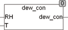

<!--
  Copyright (c) 2026 Hans Mühlbauer, Franz Höpfinger and others.

  This program and the accompanying materials are made available under the
  terms of the Eclipse Public License 2.0 which is available at
  https://www.eclipse.org/legal/epl-2.0

  SPDX-License-Identifier: EPL-2.0
-->

## DEW_CON

| | |
|:---|:---|
| **Type	Funktion** | REAL |
| **Input	RH** | REAL (Relative Feuchte) |
| **T** | REAL (Temperatur in °C) |
| **Output** | REAL (Wasserdampf Konzentration in Gramm / m³) |
| | Der Baustein DEW_CON berechnet aus der Relativen Feuchte (RH) und der Temperatur (T in °C) die Wasserdampfkonzentration in der Luft. Das Ergebnis wird in Gramm / m³ ermittelt. RH ist in % (50 = 50%) anzugeben und die Temperatur in °C. |
| | Die Baustein ist für Temperaturen von -40°C bis +90°C geeignet. |

