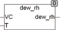

<!--
  Copyright (c) 2026 Hans Mühlbauer, Franz Höpfinger and others.

  This program and the accompanying materials are made available under the
  terms of the Eclipse Public License 2.0 which is available at
  https://www.eclipse.org/legal/epl-2.0

  SPDX-License-Identifier: EPL-2.0
-->

## Type	Funktion : REAL

| | |
|:---|:---|
| **Input	VC** | REAL (Wasserdampfkonzentration in Luft in Gramm / m³) |
| **T** | REAL (Temperatur in °C) |
| **Output** | REAL (Relative Luftfeuchtigkeit in %) |
| | Der Baustein DEW_RH berechnet aus der Wasserdampfkonzentration (VC) und der Temperatur (T in °C) die relative Luftfeuchtigkeit in % (50 = 50%). Die Wasserdampfkonzentration wird in Gramm/m³ angegeben. DEW_CON kann für Berechnungen in beide Richtungen (aufheizen und abkühlen) verwendet werden. Wird zu stark abgekühlt, so ist die maximale relative Feuchte auf 100% begrenzt. Für Berechnungen des Taupunktes wird der Baustein DEW_TEMP empfohlen. |
| | Im folgenden Beispiel wird der Fall berechnet, wenn Luft von 30°C und relativer Feuchte von 50% um 6 Grad abgekühlt wird. Der Baustein DEW_CON liefert die Feuchtigkeitskonzentration in der Ausgangsluft von 30° und DEW_RH berechnet die resultierende relative Luftfeuchtigkeit RH von 69,7%. Diese Berechnungen sind wichtig, wenn Luft abgekühlt oder aufgeheizt wird. In Klimaanlagen ist eine resultierende relative Feuchte von 100% wegen Taubildung und den daraus resultierenden Problemen zu vermeiden. |
| | Siehe hierzu auch die Bausteine DEW_CON und DEW_TEMP. |

