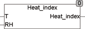

<!--
  Copyright (c) 2026 Hans Mühlbauer, Franz Höpfinger and others.

  This program and the accompanying materials are made available under the
  terms of the Eclipse Public License 2.0 which is available at
  https://www.eclipse.org/legal/epl-2.0

  SPDX-License-Identifier: EPL-2.0
-->

## Type	Funktion : REAL

| | |
|:---|:---|
| **Input	T** | REAL (Temperatur in °C) |
| **RH** | REAL (Relative Feuchte) |
| **Output** | REAL (Heat Index Temperatur) |
| | HEAT_INDEX berechnet die bei hohen Temperaturen und hoher Feuchte gefühlte Temperatur. Die Funktion ist definiert für Temperaturen größer 20 °C und relativer Feuchte > 10%. Für Werte außerhalb des Definitionsbereichs wird die Eingangstemperatur ausgegeben. |

