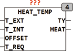
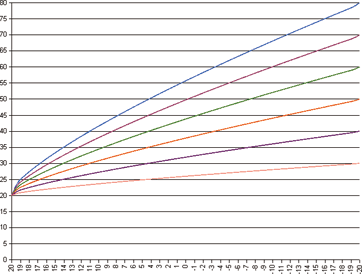

<!--
  Copyright (c) 2026 Hans Mühlbauer, Franz Höpfinger and others.

  This program and the accompanying materials are made available under the
  terms of the Eclipse Public License 2.0 which is available at
  https://www.eclipse.org/legal/epl-2.0

  SPDX-License-Identifier: EPL-2.0
-->

## HEAT_TEMP

| | |
|:---|:---|
| **Type** | Funktionsbaustein |
| **Input	T_EXT** | REAL (Außentemperatur) |
| **T_INT** | REAL (Soll Raumtemperatur) |
| **OFFSET** | REAL (Absenkung oder Anhebung der |
| | Raumtemperatur) |
| **T_REQ** | REAL (Temperaturanforderung) |
| **Output	TY** | REAL (Heizkreisvorlauftemperatur) |
| **HEAT** | BOOL (Heizungsanforderung) |
| **Setup	TY_MAX** | REAL (maximale Heizkreistemperatur, 70°C) |
| **TY_MIN** | REAL (Minimale Heizkreistemperatur, 25°C) |
| **TY_C** | REAL (Auslegungstemperatur, 70°C) |
| **T_INT_C** | REAL (Auslegungstemperatur Raum, 20°C) |
| **T_EXT_C** | REAL (T_EXT bei Auslegungstemperatur -15°C) |
| **T_DIFF_C** | REAL (Vor- Rücklaufdifferenz 10°C) |
| **C** | REAL (Konstante des Heizsystems, DEFAULT = 1,33) |
| **H** | REAL (Schwelle für Heizungsanforderung 3°C) |
| **HEAT_TEMPberechnet die Vorlauftemperatur aus der Außentemperatur nach folgender Formel** |  |
| | TY =  TR + T_DIFF / 2 * TX + (TY_Setup - T_DIFF / 2 - TR) * TX ^ (1 / C) |
| **mit** | TR = T_INT + OFFSET |
| **TX** | = (TR - T_EXT) / (T_INT_Setup - T_EXT_Setup); |
| | Die Parameter der Heizkurve werden durch die Setup Variablen TY_C (Auslegungsvorlauftemperatur), T_INT_C (Raumtemperatur im Auslegungspunkt), T_EXT_C (Außentemperatur im Auslegungspunkt) und T_DIFF_C (Differenz Vor- Rücklauf im Auslegungspunkt) vorgegeben. Mit dem Eingang Offset kann die Heizkurve an Raumabsenkung (negativer Offset) oder Raumanhebung (positiver Offset) angepasst werden. Mit den Setup Variablen TY_MIN und TY_MAX kann die Vorlauftemperatur auf einen Minimal- und Maximalwert begrenzt werden. Der Eingang T_REQ dient dazu, externe Temperaturanforderungen wie z.B. vom Boiler zu unterstützen. Ist T_REQ größer als der aus der Heizkurve berechnete Wert für TY, so wird TY auf T_REQ gesetzt. Die Begrenzung auf TY_MAX gilt nicht für die Anforderung durch T_REQ. Durch die Setup Variable H wird festgelegt ab welcher Außentemperatur die Heizkurve berechnet wird, solange T_EXT + H >= als T_INT + OFFSET ist bleibt TY auf 0 und HEAT ist FALSE. Wird T_EXT + H < als T_INT + OFFSET wird HEAT TRUE und TY gibt die berechnete Vorlauftemperatur aus. Die Setup Variable C legt die Krümmung der Heizkurve fest. Die Krümmung ist abhängig vom verwendeten Heizsystem. |
| **Konvektoren** | C = 1.25 – 1.45 |
| **Plattenheizkörper** | C = 1.20 – 1.30 |
| **Radiatoren** | C = 1.30 |
| **Rohre** | C = 1.25 |
| **Fußbodenheizung** | C = 1.1 |
| | Je größer der Wert von C, desto stärker ist die Heizkurve gekrümmt. Ein Wert von 1.0 ergibt eine Gerade als Heizkurve.  Typische Heizsysteme liegen zwischen 1.0 und 1.5. |
| **Die Grafik zeigt Heizkurven für Auslegungstemperaturen von 30 – 80 °C Vorlauftemperatur bei -20°C Außentemperatur und bei einem C von 1.33** |  |

