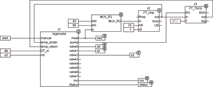

<!--
  Copyright (c) 2026 Hans Mühlbauer, Franz Höpfinger and others.

  This program and the accompanying materials are made available under the
  terms of the Eclipse Public License 2.0 which is available at
  https://www.eclipse.org/legal/epl-2.0

  SPDX-License-Identifier: EPL-2.0
-->

## LEGIONELLA

| | |
|:---|:---|
| **Type** | Funktionsbaustein |
| **Input	MANUAL** | BOOL (Manual Start Input) |
| **TEMP_BOILER** | REAL (Boiler Temperatur) |
| **TEMP_RETURN** | REAL (Temperatur der Zirkulationsleitung) |
| **DT_IN** | DATE_TIME (Momentane Tageszeit und Datum) |
| **RST** | BOOL (Asynchroner Reset) |
| **Output	HEAT** | BOOL (Steuersignal für Warmwasserheizung) |
| **PUMP** | BOOL (Steuersignal für Zirkulationspumpe) |
| **STATUS** | Byte (ESR kompatibler Statusausgang) |
| **VALVE0..7** | BOOL (Steuerausgänge für Ventile der Zirkulation) |
| **RUN** | BOOL (TRUE wenn Sequenz läuft) |
| **Setup	T_START** | TOD (Tageszeit zu der die Desinfizierung startet) |
| **DAY** | INT (Wochentag an dem die Desinfizierung startet) |
| **TEMP_SET** | REAL (Temperatur des Boilers) |
| **TEMP_OFFSET** | REAL () |
| **TEMP_HYS** | REAL () |
| **T_MAX_HEAT** | TIME (maximale Zeit zum Aufheizen des Boilers) |
| **T_MAX_RETURN** | TIME (maximale Zeit, bis der Eingang |
| | TEMP_RETURN nach VALVE aktiv wird) |
| **TP_0 .. 7** | TIME (Desinfektionszeit für Kreise 0..7) |
| | LEGIONELLA hat eine integrierte Schaltuhr, die an einem bestimmten Wochentag (DAY) zu einer bestimmten Tageszeit (T_START) die Desinfektion startet. Hierzu ist die externe Anschaltung der Lokalzeit nötig (DT_IN). Jederzeit kann mit einer steigenden Flanke an MANUAL die Desinfektion auch von Hand gestartet werden. |
| | Der Ablauf eines Desinfektionszyklus wird mit einem internen Start aufgrund von DT_IN, DAY und T_START, oder durch eine steigende Flanke an MANUAL gestartet.  Der Ausgang HEAT wird TRUE und steuert die Heizung des Boilers an. Innerhalb der Aufheizzeit T_MAX_HEAT muss dann das Eingangssignal TEMP_BOILER auf TRUE gehen. Wird die Temperatur nicht innerhalb von T_MAX_HEAT gemeldet, geht der Ausgang Status auf Störung. Die Desinfektion läuft aber trotzdem weiter. Nach der Aufheizphase wird die Boilertemperatur gemessen und falls nötig durch TRUE am Ausgang HEAT wieder nachgeheizt. Sobald die Boilertemperatur erreicht ist, wird PUMP TRUE und die Zirkulationspumpe eingeschaltet. Dann werden nacheinander die einzelnen Ventile geöffnet und gemessen, ob innerhalb der Zeit T_MAX_RETURN die Temperatur am Rücklauf der Zirkulationsleitung erreicht wurde. Falls ein Rückflussthermometer nicht vorhanden ist, kann der Eingang T_MAX_RETURN einfach offen bleiben. |
| **Der Ausgang Status ist ESR kompatibel und kann folgende Meldungen abgeben** |  |
| **110** | Wartestellung 111	Sequenz läuft |
| **1** | Boiler Temperatur wurde nicht erreicht |
| **2** | Rücklauftemperatur bei Ventil0 wurde nicht erreicht |
| **3..8** | Rücklauftemperatur bei Ventil1..7 wurde nicht erreicht |
| **Schematischer interner Aufbau von LEGIONELLA** |  |
| **Das Folgende Beispiel zeigt eine Simulation für 2 Desinfektionskreise mit Traceaufzeichnung. In diesem Aufbau ist VALVE2 auf den Eingang RST geschaltet und unterbricht damit die Sequenz nach 2 Kreisen** |  |

