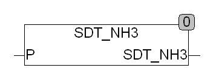

<!--
  Copyright (c) 2026 Hans Mühlbauer, Franz Höpfinger and others.

  This program and the accompanying materials are made available under the
  terms of the Eclipse Public License 2.0 which is available at
  https://www.eclipse.org/legal/epl-2.0

  SPDX-License-Identifier: EPL-2.0
-->

## Type	Funktion : REAL

| | |
|:---|:---|
| **Input	T** | REAL (Temperatur in °C) |
| **Output** | REAL (Sättigungsdampfdruck in Pa) |
| | SDT_NH3 berechnet die Sättigungsdampftemperatur für Ammoniak (NH3). Der Druck P wird in °C angegeben. Der Gültigkeitsbereich der Funktion liegt bei 0.001 bar bis 60 bar. |

