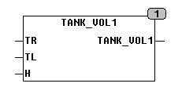

<!--
  Copyright (c) 2026 Hans Mühlbauer, Franz Höpfinger and others.

  This program and the accompanying materials are made available under the
  terms of the Eclipse Public License 2.0 which is available at
  https://www.eclipse.org/legal/epl-2.0

  SPDX-License-Identifier: EPL-2.0
-->

## TANK_VOL1

| | | |
|:---|:---|:---|
| **Type	Funktion** | REAL | |
| **Input	TR** | REAL | (Radius des Tanks) |
| **TL** | REAL | (Länge des Tanks) |
| **H** | REAL | (Füllhöhe des Tanks) |
| **Output** | Real	(Inhalt des Tanks bis zur Füllhöhe) | |
| | TANK_VOL1 berechnet den Inhalt eines Rohrförmigen Tanks der bis zur Höhe H gefüllt ist. | |

