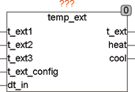

<!--
  Copyright (c) 2026 Hans Mühlbauer, Franz Höpfinger and others.

  This program and the accompanying materials are made available under the
  terms of the Eclipse Public License 2.0 which is available at
  https://www.eclipse.org/legal/epl-2.0

  SPDX-License-Identifier: EPL-2.0
-->

## Type	Funktionsbaustein

| | |
|:---|:---|
| **Input	T_EXT1** | REAL (Außentemperatur Sensor 1) |
| **T_EXT2** | REAL (Außentemperatur Sensor 2) |
| **T_EXT3** | REAL (Außentemperatur Sensor 3) |
| **T_EXT_Setup** | BYTE (Abfragemodus) |
| **DT_IN** | DATE_TIME (Tageszeit) |
| **Output	T_EXT** | REAL (Ausgang Außentemperatur) |
| **HEAT** | BOOL (Heizsignal) |
| **COOL** | BOOL (Kühlsignal) |
| **Setup	T_EXT_MIN** | REAL (Minimum Außentemperatur) |
| **T_EXT_MAX** | REAL (Maximum Außentemperatur) |
| **T_EXT_DEFAULT** | REAL (Default Außentemperatur) |
| **HEAT_PERIOD_START** | DATE (Beginn der Heizperiode) |
| **HEAT_PERIOD_STOP** | DATE (Ende der Heizperiode) |
| **COOL_PERIOD_START** | DATE (Beginn der Kühlperiode) |
| **COOL_PERIOD_STOP** | DATE (Ende der Kühlperiode) |
| | HEAT_START_TEAMP_DAY (Heiztriggertemperatur Tag) |
| | HEAT_START_TEAMP_NIGHT (Heiztriggertemperatur Nacht) |
| **HEAT_STOP_TEMP** | REAL (Heizen Stopp Temperatur) |
| | COOL_START_TEAMP_DAY (Kühl Start Temperatur Tag) |
| | COOL_START_TEMP_NIGHT (Kühl Start Temperatur Nacht) |
| **COOL_STOP_TEMP** | REAL (Kühl Stopp Temperatur) |
| **START_DAY** | TOD (Anfang des Tages) |
| **START_NIGHT** | TOD (Anfang der Nacht) |
| **CYCLE_TIME** | TIME (Abfragezeit für Außentemperatur) |
| | TEMP_EXT verarbeitet bis zu 3 Außentemperaturfühler und stellt eine durch Mode selektierte Außentemperatur der Heizungsregelung zur Verfügung. Es errechnet Signale für Heizung und Kühlung abhängig von Außentemperatur, Datum und Uhrzeit. Mit dem Eingang T_EXT_Setup wird festgelegt, wie der Ausgangswert T_EXT ermittelt wird. Wird T_EXT_Setup nicht beschaltet, so ist der Vorgabewert 0. Die Setup-Werte T_EXT_MIN und T_EXT_Max legen den Mindestwert und Maximalwert der Außentemperatureingänge fest. Werden diese Grenzen über- oder unterschritten, so wird von einem Fehler im Sensor oder Drahtbruch ausgegangen und an Stelle des Messwertes der Vorgabewert T_EXT_DEFAULT benutzt. |
| | Mit den Setup-Variablen HEAT_PERIOD und COOL_PERIOD wird definiert, wann Heizen und wann Kühlen erlaubt ist. Die Entscheidung, ob der Ausgang HEAT oder COOL TRUE wird hängt weiterhin von den Setup-Werten HEAT_START- HEAT_STOP und COOL_START und COOL_STOP ab. Diese Werte können separat für Tag und Nacht definiert werden. Der Start für eine Tag- und Nachtperiode kann durch die Setup-Variablen START_DAY und START_NIGHT festgelegt werden. Ein Variable CYCLE_TIME legt fest, wie oft die Außentemperatur abgefragt werden soll. |

| T_EXT_Setup | T_EXT |
| --- | --- |
| 0 | Durchschnittswert von T_EXT1, T_ext2 und T_ext3 |
| 1 | T_EXT1 |
| 2 | T_EXT2 |
| 3 | T_EXT3 |
| 4 | T_EXT_DEFAULT |
| 5 | Niedrigster Wert der 3 Eingänge |
| 6 | Höchster Wert der 3 Eingänge |
| 7 | Mittlerer Wert der 3 Eingänge |
