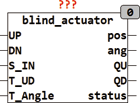
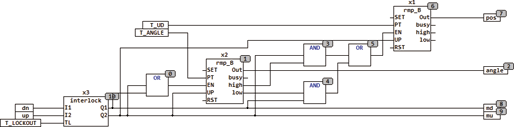

<!--
  Copyright (c) 2026 Hans Mühlbauer, Franz Höpfinger and others.

  This program and the accompanying materials are made available under the
  terms of the Eclipse Public License 2.0 which is available at
  https://www.eclipse.org/legal/epl-2.0

  SPDX-License-Identifier: EPL-2.0
-->

## Type	Funktionsbaustein

| | |
|:---|:---|
| **Input	UP** | BOOL (Eingang AUF) |
| **DN** | BOOL (Eingang AB) |
| **S_IN** | BYTE (ESR kompatibler Status Eingang) |
| **T_UD** | TIME (Laufzeit AUF / AB) |
| **T_ANGLE** | TIME (Laufzeit der Lamellenverstellung) |
| **Output	POS** | BYTE (Position der Jalousie, 0 = unten, 255 = oben) |
| **ANG** | BYTE (Winkel der Lamelle, 0 = vertikal, 255 = horiz.) |
| **QU** | BOOL (Motor Auf Signal) |
| **QD** | BOOL (Motor Ab Signal) |
| **STATUS** | BYTE (ESR kompatibler Status Ausgang) |
| **BLIND_ACTUATOR ist ein Jalousie / Rollladen Aktor mit Simulation der Position und der Winkelstellung der Lamellen. Die Eingänge UP und DN sind gegenseitig verriegelt, so dass QU und QD nie gleichzeitig aktiv sein können. Mit der Zeit T_LOCKOUT wird die minimale Pause zwischen einem Richtungswechsel festgelegt. zusätzlich bietet BLIND_ACTUATOR noch 2 Ausgänge vom Typ Byte die die jeweilige Stellung und Position der Jalousie simulieren. Für eine exakte Simulation sind die Setup Zeiten T_UD und T_ANGLE entsprechend Einzustellen. T_UD legt die Zeit fest die zum Fahren von "geschlossen" auf "offen" (hochfahren) benötigt wird. T_ANGLE spezifiziert die Zeit die zur Verstellung der Lamellen von "senkrecht" nach Horizontal benötigt wird. Der Aktor stellt sicher das beim Hochfahren zuerst die Lamellen auf Horizontal gestellt werden und anschließend erst mit dem Hochfahren begonnen wird. Umgekehrt werden beim Herunterfahren erst die Lamellen auf Senkrecht gestellt und dann mit dem Herunterfahren begonnen. POS = 0 bedeutet Jalousie heruntergefahren, und POS = 255 bedeutet Jalousie ist hochgefahren. Zwischenstellungen werden entsprechend mit Zwischenwerten 0 .. 255 ausgegeben. Der Winkel der Lamellen wird durch den Ausgang ANG ausgegeben, wobei ANG = 0 die vertikale Stellung und ANG = 255 die horizontale Stellung bedeuten, Werte zwischen 0 und 255 geben den entsprechenden Winkel an. Durch die Ausgänge POS und ANG wird die Information über die Jalousie Stellung der Steuerung zur Verfügung gestellt. ANG und POS können jedoch nur sinnvolle Werte liefern wenn die Zeiten T_UD und T_ANGLE exakt für die entsprechende Jalousie angepasst sind. Der Aktor kann, wenn T_ANGLE auf T#0s gesetzt wird auch für Rollladen aller Arten verwendet werden. Die Eingänge T_UD, T_ANGLE und T_LOCKOUT haben folgende Vorgabewerte** |  |
| | T_UD = T#10S |
| | T_ANGLE = T#3S |
| | T_LOCKOUT = T#100MS |
| | Der Eingang S_IN und der Ausgang STATUS sind ESR kompatible Aus und Eingänge , über den Eingang S_IN melden vorgeschaltete Funktionen Ihren Status an das Modul, dieser Status wird an den Ausgang STATUS weitergeleitet, und eigene Statusmeldungen werden über STATUS Ausgegeben. Wenn am Eingang eine Statusmeldung vorliegt überschreibt diese die eigenen Statusmeldungen, ein Fehler wird mit höchster Priorität ausgegeben. |
| **Die folgende Grafik zeigt den inneren Aufbau und die Funktionsweise des Moduls** |  |
| **Setup	T_LOCKOUT** | TIME (Totzeit zwischen Richtungswechsel) |

| STATUS | Bedeutung |
| --- | --- |
| 0 | keine Meldung |
| 1 | Fehler, UP und DN gleichzeitig aktiv |
| 101 | Manual UP |
| 102 | Manual DN |
| NNN | weitergereichte Meldung |
