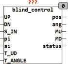
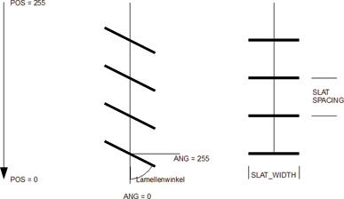

<!--
  Copyright (c) 2026 Hans Mühlbauer, Franz Höpfinger and others.

  This program and the accompanying materials are made available under the
  terms of the Eclipse Public License 2.0 which is available at
  https://www.eclipse.org/legal/epl-2.0

  SPDX-License-Identifier: EPL-2.0
-->

## Type	Funktionsbaustein

| | |
|:---|:---|
| **Input	UP** | BOOL (Eingang AUF) |
| **DN** | BOOL (Eingang AB) |
| **S_IN** | BYTE (ESR kompatibler Status Eingang) |
| **PI** | BYTE (Vorgabe der Position) |
| **AI** | BYTE (Vorgabe des Lamellenwinkels) |
| **T_UD** | TIME (Zeit zum Hochfahren von 0 .. 255) |
| **T_ANGLE** | TIME (Zeit um den Lamellenwinkel von 0 .. 255 |
| | zu verstellen) |
| **Output	POS** | BYTE (Simulierte Jalousiestellung) |
| **ANG** | BYTE (Simulierter Lamellenwinkel) |
| **MU** | BOOL (Motor Auf Signal) |
| **MD** | BOOL (Motor Ab Signal) |
| **STATUS** | BYTE (ESR kompatibler Status Ausgang) |
| | BLIND_CONTROL regelt die Jalousiestellung und den Lamellenwinkel gemäß den Vorgaben von PI und AI wenn UP und DN gleichzeitig TRUE sind (Automatik Modus). POS und ANG sind dabei die Aktualwerte der Jalousie, An diesen Ausgängen simuliert der Baustein den aktuellen Winkel und die Position der Jalousie. BLIND_CONTROL schaltet die Ausgänge MU oder MD solange in der geeigneten Reihenfolge auf TRUE bis die Werte an POS und ANG den Sollwerten an PI und AI entsprechen. Ein interner Sequenzer berücksichtigt dabei dass beim Auf- und Ab-fahren der Jalousie sich der Lamellenwinkel zuerst verstellt und anschließend erst das Hoch- oder Runter-fahren Der Jalousie beginnt. Wird also die Jalousie Hoch- oder Runter-gefahren so verstellt sich zwangsläufig der Lamellenwinkel welcher dann anschließend wieder durch entsprechende Gegenfahrt eingestellt werden muss. Der Eingang SENS legt fest ab welche Regeldifferenz die Regelung aktiv wird und den Ausgang so einstellt das er den Eingängen PI und AI entspricht. Ist SENS = 0 so wird jede Abweichung ausgeregelt, Ist SENS = 5 (Vorgabewert) so wird erst ab einer Differenz von 5 zwischen den Vorgabewerten und den tatsächlichen werten ausgeregelt. Wenn UP und DN nicht beide TRUE sind verlässt BLIND_CONTROL den Automatikmodus und die Ausgänge QU und QD werden im Handbetrieb direkt von UP und DN gesteuert. BLIND_CONTROL benötigt nicht den Baustein BLIND_ACTUATOR um eine JALOUSIE zu steuern, BLIND_ACTUATOR ist bereits in BLIND_CONTROL integriert. Wenn keine Automatische Regelung der Jalousie benötigt wird so kann auf BLIND_CONTROL verzichtet werden und BLIND_ACTUATOR zum Einsatz kommen. Beim Einsatz von BLIND_CONTROL ist darauf zu achten dass die Zykluszeit für den Baustein kleiner als T_ANGLE / 512 * SENS beträgt. SENS kann durch einen Doppelklick auf das grafische Symbol von BLIND_CONTROL verändert werden, der Vorgabewert ist 5. Wird die Zykluszeit zu groß so beginnt die Jalousie unregelmäßig hin und herzufahren. Wenn eine kleiner Zykluszeit nicht möglich ist kann der Wert von SENS vergrößert werden. |
| **Die folgende Grafik verdeutlicht die Geometrie der Jalousie** |  |
| **Die folgende Tabelle stellt die Betriebszustände des Bausteins dar** |  |
| | Der Eingang S_IN und der Ausgang STATUS sind ESR kompatible Aus und Eingänge , über den Eingang S_IN melden vorgeschaltete Funktionen Ihren Status an das Modul, dieser Status wird an den Ausgang STATUS weitergeleitet, und eigene Statusmeldungen werden über STATUS Ausgegeben. |
| **Setup	SENS** | BYTE (Auflösung der Regelung) |
| **T_LOCKOUT** | TIME (Totzeit bei Richtungswechsel der Motoren) |

| UP | DN | PI | AI | MU | MD |  |
| --- | --- | --- | --- | --- | --- | --- |
| L | L | - | - | L | L | keine Aktion |
| H | L | - | - | H | L | Jalousie fährt aufwärts |
| L | H | - | - | L | H | Jalousie fährt abwärts |
| H | H | P | A | X | X | Position P und Winkel A werden Automatisch angefahren |

| STATUS | Bedeutung |
| --- | --- |
| 0 | keine Meldung |
| 101 | Manual Auf |
| 102 | Manual Ab |
| 121 | Position Auf |
| 122 | Position Ab |
| 123 | Lamellenstellung Horizontal |
| 124 | Lamellenstellung Vertikal |
| NNN | weitergereichte Meldungen |
