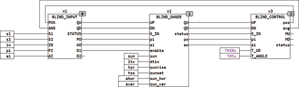

<!--
  Copyright (c) 2026 Hans Mühlbauer, Franz Höpfinger and others.

  This program and the accompanying materials are made available under the
  terms of the Eclipse Public License 2.0 which is available at
  https://www.eclipse.org/legal/epl-2.0

  SPDX-License-Identifier: EPL-2.0
-->

## Type	Funktionsbaustein

| | |
|:---|:---|
| **Input	POS** | BYTE (Rückführung der Jalousiestellung) |
| **ANG** | BYTE (Rückführung des Lamellenwinkels) |
| **S1** | BOOL (Eingang AUF) |
| **S2** | BOOL (Eingang AB) |
| **IN** | BOOL (Gesteuerter Betrieb wenn TRUE) |
| **PI** | BYTE (Position wenn IN = TRUE) |
| **AI** | BYTE (Winkel  wenn IN = TRUE) |
| **Output	QU** | BOOL (Motor Auf Signal) |
| **QD** | BOOL (Motor Ab Signal) |
| **STATUS** | BYTE (ESR kompatibler Status Ausgang) |
| **PO** | BYTE (Ausgang Position) |
| **AO** | BYTE (Ausgang Winkelstellung) |
| **D1** | BOOL (Kommandoausgang für Doppelklick Funktion 1) |
| **D2** | BOOL (Kommandoausgang für Doppelklick Funktion 2) |
| | BLIND_INPUT dient als Taster Interface zur Bedienung von Jalousien. Der Baustein unterstützt 3 Modi, Handbetrieb, Automatikbetrieb und gesteuerter Betrieb. wenn IN = FALSE (Handbetrieb) werden die Eingänge S1 und S2 benutzt um die Ausgänge QU und QD zu steuern. Wenn die Setup Variable SINGLE_SWITCH = TRUE ist, dann wird der Eingang S2 ignoriert, und die gesamte Steuerung erfolgt über den Taster S1. S1 schaltet dann abwechselnd QU und QD so dass durch aufeinander folgendes Drücken des Tasters S1 zwischen Auf und Ab Bewegung gewechselt wird. Der interne Vorgabewert ist FALSE (2 Taster Konfiguration). Die Setup Variable MANUAL_TIMEOUT definiert nach welcher Ruhezeit (Zeit ohne Signal auf S1 oder S2 der Baustein selbständig in den Automatikbetrieb wechselt. Wird dieser Wert nicht spezifiziert so wird der Interne Vorgabewert von 1 Stunde  verwendet. Wenn der Eingang IN = TRUE ist, werden die Ausgänge QU und QD auf Automatik (beide TRUE) gesetzt und die Eingänge PI und AI auf die Ausgänge PO und AO geschaltet. IN kann zur Übernahme der Werte kurz gepulst werden, der Baustein steuert diese Werte für die Zeit MAX_RUNTIME an und schaltet dann wieder in den Automatikmodus. Solange IN = TRUE bleibt wird der Automatikmodus mit den Werten von AI und PI forciert. Die Eingänge POS und  ANG sind die Rückführungseingänge für die aktuelle Position der Jalousie. Diese Werte werden von dem Modul BLIND_CONTROL bereitgestellt. Mit der SETUP Variable CLICK_MODE wird ein Klick Betrieb festgelegt, ein kurzer Tastendruck startet die Richtung Auf für S1 und Ab für S2 und ein zweiter kurzer Tastendruck beendet die entsprechende Richtung oder kehrt die Richtung um. Diese Einstellung ist für Rollladen mit langer Laufzeit Sinnvoll, oder um mit einem kurzen Tastendruck in eine Endstellung zu fahren. wird der Tastendruck länger als die Setup Zeit CLICK_TIME so wird für diesen Tastendruck der CLICK Modus verlassen und die Jalousie fährt solange wie die Taste gedrückt bleibt im Handbetrieb. Ist ein Tastendruck kürzer als CLICK_TIME so Fährt die Jalousie weiter bis ein weiterer Klick die Fahrt beendet oder eine Endstellung erreicht wird. Der Vorgabewert für CLICK_TIME ist 500 Millisekunden und die Vorgabe für CLICK_MODE ist TRUE. Wenn beide Setup Variablen CLICK_MODE und SINGLE_SWITCH gleichzeitig TRUE sind wird ein Tastbetrieb mit nur einem Taster an S1 ermöglicht. Mit der über MAX_RUNTIME eingestellten Zeit wird die Laufzeit begrenzt die durch einen einfachen Click gestartet wird aber nicht mit einem weiteren Click beendet wird. Der Wert von MAX_RUNTIME ist mit T#60s vorbelegt und sollte solange sein das die Jalousie sicher aus jeder beliebigen Stellung die Endstellung erreichen kann. Zwei Ausgänge D1 und D2 können benutzt werden um einen Doppelklick auf S1 oder S2 auszuwerten, wenn D?_TOGGLE = TRUE schaltet ein Doppelklick den entsprechenden Ausgang ein und ein weitere Doppelklick wieder aus, ist D?_TOGGLE = FALSE so wird mit jedem Doppelklick ein Impuls am entsprechenden Ausgang erzeugt. |
| | Nach einem manuellen Fahrbefehl bleibt der Baustein für die Zeit MANUAL_TIMEOUT im Modus „Manual Standby“ (STATUS = 131), die manuell angefahrene Position wird also für diese Zeit beibehalten und auch die Automatikfunktionen aller nachgeschalteten Bausteine werden unterdrückt. Durch einen langen (länger als CLICK_TIME) Druck auf beide Taster, kann der „Manual Standby“-Modus vorzeitig beendet und in den Automatikmodus zurückgekehrt werden. |
| **Die folgende Tabelle zeigt die Betriebszustände des Bausteins** |  |
| | Der Ausgang STATUS ist ESR kompatibel und gibt Statusmeldungen über Zustandsänderungen aus. |
| **Das folgende Beispiel zeigt den Aufbau eines Jalousiecontrollers mit dem Baustein BLIND_INPUT und BLIND_CONTROL** |  |
| | Die Verwendung weiterer BLIND Module ist optional und dient dazu den Funktionsumfang zu erweitern. BLIND_INPUT und BLIND_CONTROL ergeben bereits eine vollwertige Jalousiesteuerung. |
| | BLIND_INPUT kann an den beiden Eingängen S1 und S2 jeweils einen Doppelklick dekodieren und schaltet damit die beiden Ausgänge D1 und D2. Diese Ausgänge können dazu benutzt werden nachgeschaltete Funktionsblöcke oder sonstige Ereignisse zu steuern. |
| **Master Mode** |  |
| | Mit der Variable MASTER_MODE = TRUE kann der Master Mode eingeschaltet werden. Im Master Modus wird verhindert das Winkel ANG und Position POS an die Ausgänge AO und PO im Standby Mode 130 übertragen werden. Blind Bausteine die zwischen die Input- und Control- Module geschaltet sind können die Stellung der Jalousie verändern und nach Beenden der Veränderung verharrt die Jalousie in der neuen Stellung (wenn MASTER_MODE = FALSE). Wird jedoch die Variable MASTER_MODE = TRUE gesetzt so wird sichergestellt das nach beenden eines Automatischen Eingriffs durch nachgeschaltete Module der Blind Input wieder selbständig die alte Position anfährt. Wenn MASTER_MODE = FALSE wird im Status 130 POS und ANG auf die Ausgänge PO und AO übertragen. Ist MASTER_MODE = TRUE beleibt im STATUS 130 an den Ausgängen PO und AO der letzte gültige Wert erhalten und die Eingänge POS und ANG werden nicht übertragen. Das Modul BLIND_INPUT behält also die letzte gültige BLIND_INPUT Position. |
| **Setup	SINGLE_SWITCH** | BOOL (TRUE für Einzeltasterbetrieb) |
| **CLICK_EN** | BOOL (TRUE für Single Klick Mode) |
| **CLICK_TIME** | TIME (Timeout für Klick Erkennung) |
| **MAX_RUNTIME** | TIME (Timeout für eine Bewegung) |
| **MANUAL_TIMEOUT** | TIME (Timeout des Handbetriebs) |
| **DEBOUNCE_TIME** | TIME (Entprellzeit für die Eingänge S) |
| **DBL_CLK1** | BOOL (bei Doppelklick Position anfahren wenn TRUE) |
| **DBL_POS1** | BYTE (Position bei S1 Doppelklick) |
| **DBL_ANG1** | BYTE (Winkel bei S1 Doppelklick) |
| **DBL_CLK2** | BOOL (bei Doppelklick Position anfahren wenn TRUE) |
| **DBL_POS2** | BYTE := 255 (Position bei S2 Doppelklick) |
| **DBL_ANG2** | BYTE := 255 (Winkel bei S2 Doppelklick) |
| **D1_TOGGLE** | BOOL := TRUE (Toggle Modus für D1) |
| **D2_TOGGLE** | BOOL := TRUE (Toggle Modus für D2) |
| **MASTER_MODE** | BOOL (aktiviert den Master Mode wenn TRUE) |

| POSANG | S1 | S2 | IN | PIAI | QU | QD | POAO | D1 | D2 |  |
| --- | --- | --- | --- | --- | --- | --- | --- | --- | --- | --- |
| X | L | L | L | - | H | H | X*5 | - | - | Standy / Automatik Betrieb |
| - | - | - | H | Y | H | H | Y | - | - | gesteuerter Betrieb, PI und AI werden angefahren |
| X | H | L | L | - | H | L | X | - | - | Handbetrieb Auf |
| X | L | H | L | - | L | H | X | - | - | Handbetrieb Ab |
| X | H | H | L | - | H | H | X | - | - | Manual Mode vorzeitig Beenden |
| X | L | L | L | - | L | L | X | - | - | Handbetrieb Standby bis Timeout abläuft |
| X | *4 | L | L | - | H | L | X | - | - | CLICK_EN = TRUE |
| X | L | *4 | L | - | L | H | X | - | - | CLICK_EN = TRUE |
| - | *2 | L | L | - | H | H | - | /D1 | - | D1_TOGGLE = TRUE |
| - | *2 | L | L | - | H | H | - | *3 | - | D1_TOGGLE = FALSE |
| - | L | *2 | L | - | H | H | - | - | /D2 | D2_TOGGLE = TRUE |
| - | L | *2 | L | - | H | H | - | - | *3 | D2_TOGGLE = FALSE |
| *1  bei Übergang in den Automatikbetrieb werden die Ausgänge PO und AO auf den letzten Stand von POS und ANG gesetzt*2  Doppelklick*3  Ausgangsimpuls für einen Zyklus*4  Single Klick, Jalousie läuft für MAX_RUNTIME in eine Richtung*5  Winkel und Position werden nicht übertragen wenn die Variable MASTER_MODE = TRUE ist |

| STATUS | Bedeutung |
| --- | --- |
| 130 | Standby Modus |
| 131 | Manual Standby |
| 132 | Manual Auf |
| 133 | Manual Ab |
| 134 | Single Klick Auf |
| 135 | Single Klick Ab |
| 136 | IN = TRUE forcierte Werte |
| 137 | Doppelklick Position 1 wird angefahren |
| 138 | Doppelklick Position 2 wird angefahren |
| 139 | Force Automatik Mode |
