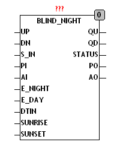

<!--
  Copyright (c) 2026 Hans Mühlbauer, Franz Höpfinger and others.

  This program and the accompanying materials are made available under the
  terms of the Eclipse Public License 2.0 which is available at
  https://www.eclipse.org/legal/epl-2.0

  SPDX-License-Identifier: EPL-2.0
-->

## BLIND_NIGHT

| | |
|:---|:---|
| **Type** | Funktionsbaustein |
| **Input	UP** | BOOL (Eingang AUF) |
| **DN** | BOOL (Eingang AB) |
| **S_IN** | BYTE (ESR kompatibler Status Eingang) |
| **PI** | BYTE (Wert der Jalousiestellung im Automatikbetrieb) |
| **AI** | BYTE (Lamellenwinkel im Automatikbetrieb) |
| **E_NIGHT** | BOOL (Automatische Nachtschaltung ein) |
| **E_DAY** | BOOL (Automatische Tagschaltung ein) |
| **DTIN** | DT (Aktuelle Zeit / Datum) |
| **SUNRISE** | TOD (Sonnenaufgangszeit) |
| **SUNSET** | TOD (Sonnenuntergangszeit) |
| **Output	QU** | BOOL (Motor Auf Signal) |
| **QD** | BOOL (Motor Ab Signal) |
| **STATUS** | BYTE (ESR kompatibler Status Ausgang) |
| **PO** | BYTE (Aktuelle Jalousiestellung) |
| **AO** | BYTE (Aktueller Lamellenwinkel) |
| | BLIND_NIGHT dient dazu die Rollladen oder Jalousie bei Nacht zu schließen. Der Baustein schließt automatisch nach Sonnenuntergang mit einer Verzögerung von SUNSET_OFFSET die Jalousie und fährt die Jalousie nach Sonnenaufgang mit einer Verzögerung von SUNRISE_OFFSET wieder hoch. Das Schließen und Öffnen kann separat mit den Eingängen E_NIGHT für schließen und E_DAY für öffnen Freigeschaltet werden. Wird zum Beispiel E_NIGHT auf TRUE gestellt und E_DAY nicht so fährt am Abend bei Dämmerung die Jalousie herunter, jedoch muss sie am nächsten Morgen manuell hochgefahren werden. Werden E_NIGHT und E_DAY nicht beschaltet so werden beide intern auf TRUE gesetzt. Damit die entsprechenden Zeiten ermittelt werden können benötigt der Baustein eine externe Datenstruktur vom Typ CALENDAR. UP, DN und S_IN sind die Eingänge von anderen BLIND Modulen und werden im Tagesbetrieb an die Ausgänge QU, QD und STATUS weitergegeben. Die Signale PI, AI und PO, AO reichen die Werte für die Position und den Lamellenwinkel der Jalousie an die folgenden Bausteine weiter. Im Nachtbetrieb werden an den Ausgängen PO und AO die Werte für den Nachtbetrieb ausgegeben, jegliche manuelle Betätigung löscht den Automatischen Nachtbetrieb. Wenn E_DAY = TRUE ist wird zum Ende der Nacht die durch DAY_POSITION und DAY_ANGLE definierte Tagesstellung hergestellt. Die Zeit RESTORE_TIME ist die maximale Zeit zum anfahren der Tagesstellung. |
| | Der Eingang S_IN und der Ausgang STATUS sind ESR kompatible Aus und Eingänge , über den Eingang S_IN melden vorgeschaltete Funktionen Ihren Status an das Modul, dieser Status wird an den Ausgang STATUS weitergeleitet, und eigene Statusmeldungen werden über STATUS Ausgegeben. |
| **Die folgende Grafik zeigt die Verschaltung von BLIND_NIGHT mit anderen Modulen zur Jalousiesteuerung** |  |
| **Setup	SUNRISE_OFFSET** | INT (Offset vom Sonnenaufgang in Minuten) |
| **SUNSET_OFFSET** | INT (Offset vom Sonnenuntergang in Min.) |
| **NIGHT_POSITION** | BYTE (Position für Nachtschaltung) |
| **NIGHT_ANGLE** | BYTE (Winkel für Nachtschaltung) |

| STATUS | Bedeutung |
| --- | --- |
| 0 | keine Meldung |
| 141 | Nachtbetrieb |
| 142 | Tagstellung wird angefahren |
| NNN | weitergereichte Meldungen |
