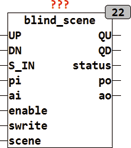

<!--
  Copyright (c) 2026 Hans Mühlbauer, Franz Höpfinger and others.

  This program and the accompanying materials are made available under the
  terms of the Eclipse Public License 2.0 which is available at
  https://www.eclipse.org/legal/epl-2.0

  SPDX-License-Identifier: EPL-2.0
-->

## Type	Funktionsbaustein

| | |
|:---|:---|
| **Input	UP** | BOOL (Eingang AUF) |
| **DN** | BOOL (Eingang AB) |
| **S_IN** | BYTE (ESR kompatibler Status Eingang) |
| **PI** | BYTE (Eingangswert der Jalousiestellung im |
| | Automatikbetrieb) |
| **AI** | BYTE (Eingangswert des Lamellenwinkels im |
| | Automatikbetrieb) |
| **ENABLE** | BOOL (Freigabeeingang für Szenen) |
| **SWRITE** | BOOL (Schreibeingang für Szenen) |
| **SCENE** | BYTE (Nummer der Szene) |
| **Output	QU** | BOOL (Motor Auf Signal) |
| **QD** | BOOL (Motor Ab Signal) |
| **STATUS** | BYTE (ESR kompatibler Status Ausgang) |
| **PO** | BYTE (Ausgangswert der Jalousiestellung im |
| | Automatikbetrieb) |
| **AO** | BYTE (Ausgangswert des Lamellenwinkels im b |
| | Automatikbetrieb) |
| | BLIND_SCENE speichert bis zu 16 Szenen bestehend aus jeweils aktueller Jalousiestellung und Winkel ab und kann diese Szenen bei Abruf wieder herstellen. jede einzelne Szene kann aktiv oder inaktiv sein, abhängig davon ob beim Speichern der Szene der Eingang ENABLE TRUE war oder nicht (ENABLE = TRUE bedeutet aktiv). Eine Szene wird abgerufen indem die Nummer der Szene ( 0 .. 15) am Eingang SCENE angelegt wird und gleichzeitig ENABLE auf TRUE gesetzt wird. Eine Szene kann nur dann abgerufen werden wenn die beiden Eingänge UP und DN gleichzeitig TRUE sind (Automatik Modus). Dadurch ist sichergestellt das eine aktive Szene immer von der Manuellen Betriebsart überschrieben wird. |
| **Die folgende Tabelle verdeutlicht die Funktionsweise von BLIND_SCENE** |  |
| | Der Eingang S_IN und der Ausgang STATUS sind ESR kompatible Aus und Eingänge , über den Eingang S_IN melden vorgeschaltete Bausteine Ihren Status an das Modul, dieser Status wird an den Ausgang STATUS weitergeleitet, und eigene Statusmeldungen werden über STATUS Ausgegeben. |
| **Die folgende Grafik zeigt die Anwendung von BLIND_SCENE mit anderen Modulen zur Ansteuerung einer Jalousie** |  |

| UP | DN | ENABLE | SWRITE | SCENE | QU | QD | PO | AO |  |
| --- | --- | --- | --- | --- | --- | --- | --- | --- | --- |
| 1 | 1 | 0 | 0 | - | 1 | 1 | PI | AI | no scene |
| - | - | 1 | 1 | y | - | - | - | - | write scene number y |
| - | - | 0 | 1 | y | - | - | - | - | disable scene number y |
| 1 | 1 | 1 | 0 | y | 1 | 1 | - | - | recall scene number y |

| STATUS | Bedeutung |
| --- | --- |
| 160 .. 175 | Szenen 0..15 aktiv |
| 176 | Szene geschrieben |
| NNN | weitergereichte Meldungen |
