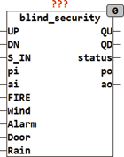
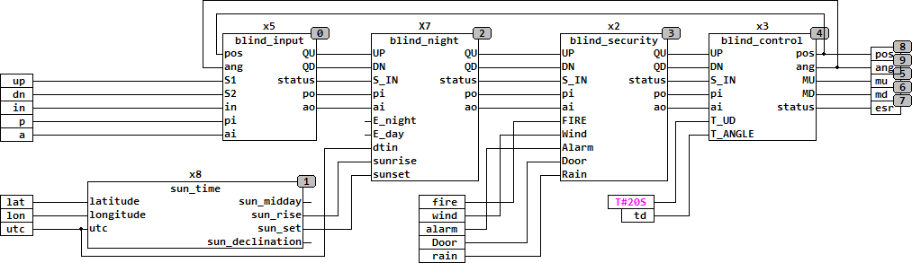

<!--
  Copyright (c) 2026 Hans Mühlbauer, Franz Höpfinger and others.

  This program and the accompanying materials are made available under the
  terms of the Eclipse Public License 2.0 which is available at
  https://www.eclipse.org/legal/epl-2.0

  SPDX-License-Identifier: EPL-2.0
-->

## Type	Funktionsbaustein

| | |
|:---|:---|
| **Input	UP** | BOOL (Eingang AUF) |
| **DN** | BOOL (Eingang AB) |
| **S_IN** | BYTE (ESR kompatibler Status Eingang) |
| **PI** | BYTE (Jalousiestellung im Automatikbetrieb) |
| **AI** | BYTE (Lamellenwinkel im Automatikbetrieb) |
| **FIRE** | BOOL (Eingang für Brandalarm) |
| **WIND** | BOOL (Eingang für Windalarm) |
| **ALARM** | BOOL (Eingang für Einbruchsmeldung) |
| **DOOR** | BOOL (Eingang für Türkontakt) |
| **RAIN** | BOOL (Eingang für Regenmelder) |
| **Output	QU** | BOOL (Motor Auf Signal) |
| **QD** | BOOL (Motor Ab Signal) |
| **STATUS** | BYTE (ESR kompatibler Status Ausgang) |
| **PO** | BYTE (Ausgangswert der Jalousiestellung im |
| | Automatikbetrieb) |
| **AO** | BYTE (Ausgangswert des Lamellenwinkels im |
| | Automatikbetrieb) |
| | BLIND_SECURITY stellt sicher das Jalousien bei bestimmten Ereignissen entweder nach oben oder nach unten gefahren werden. Die Eingänge UP und DN steuern über die Ausgänge QU und QD ein nachgeschaltetes Modul BLIND_ACTUATOR. Mit den Eingängen FIRE, WIND, ALARM und RAIN werden die Eingänge UP und DN überschrieben und die Jalousie entweder ganz nach oben oder ganz nach unten gefahren. Hierbei hat FIRE die höchste Priorität, gefolgt von WIND, Alarm und mit der niedrigsten Priorität RAIN. Rain kann als einziger auch von den manuellen Eingängen UP und DN überschrieben werden. Sollte also der Benutzer entscheiden dass trotz Regen die Jalousie offen bleiben soll, so muss er lediglich den Regenschutz durch einen kurzen Tastendruck auf UP oder DN unterbrechen. FIRE fährt die Jalousie nach oben, während RAIN, Wind und Alarm für Auf oder Ab konfigurierbar sind. ALARM ist mit der Setup Variablen ALARM_UP sowohl für Hoch- als auch Runter-Fahrt konfigurierbar, Die Setup Variable WIND_UP legt fest ob bei Wind nach oben oder runter gefahren wird. Mit der Variable RAIN_UP wird festgelegt welche Stellung bei Regen angefahren wird. Die Vorgabewerte sind UPfür Alarm, UP für Wind und DN für Regen. Die Setup Variablen können durch einen Doppelklick auf das Symbol jederzeit verändert werden. |
| | Der Eingang S_IN und der Ausgang STATUS sind ESR kompatible Aus und Eingänge , über den Eingang S_IN melden vorgeschaltete Funktionen Ihren Status an das Modul, dieser Status wird an den Ausgang STATUS weitergeleitet, und eigene Statusmeldungen werden über STATUS Ausgegeben. |
| **Die folgende Grafik zeigt die Anwendung von BLIND_SECURITY mit BLIND_ACTUATOR zur Steuerung einer Jalousie** |  |
| | BLIND_SECURITY muss unbedingt direkt vor BLIND_CONTROL eingesetzt werden.  Sollten andere Module zwischen BLIND_SECURITY und BLIND_CONTROL eingebaut werden so sind die Sicherheitsfunktionen nicht mehr gewährleistet. |
| **Setup	ALARM_UP** | BOOL (Vorgaberichtung bei ALARM, Default = Up) |
| **WIND_UP** | BOOL (Vorgaberichtung bei Wind, Default = Up) |
| **RAIN_UP** | BOOL (Vorgaberichtung bei Regen, Default = Down) |

| STATUS | Bedeutung |
| --- | --- |
| 0 | keine Meldung |
| 111 | Feuer |
| 112 | Wind |
| 113 | Einbruch Alarm |
| 114 | Türalarm |
| 115 | Regen |
| NNN | weitergereichte Meldungen |
