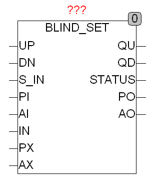

<!--
  Copyright (c) 2026 Hans Mühlbauer, Franz Höpfinger and others.

  This program and the accompanying materials are made available under the
  terms of the Eclipse Public License 2.0 which is available at
  https://www.eclipse.org/legal/epl-2.0

  SPDX-License-Identifier: EPL-2.0
-->

## Type	Funktionsbaustein

| | | |
|:---|:---|:---|
| **Input	UP** | BOOL (Eingang AUF) | |
| **DN** | BOOL (Eingang AB) | |
| **S_IN** | BYTE (ESR kompatibler Status Eingang) | |
| **PI** | BYTE (Jalousiestellung im Automatikbetrieb) | |
| **AI** | BYTE (Lamellenwinkel im Automatikbetrieb) | |
| **IN** | BOOL (Eingang für Brandalarm) | |
| **PX** | BYTE (Eingang für Windalarm) | |
| **AX** | BYTE (Eingang für Einbruchsmeldung) | |
| **Output	QU** | BOOL (Motor Auf Signal) | |
| **QD** | BOOL (Motor Ab Signal) | |
| **STATUS** | BYTE (ESR kompatibler Status Ausgang) | |
| **PO** | BYTE (Ausgangswert der Jalousiestellung) | |
| **AO** | BYTE (Ausgangswert des Lamellenwinkels) | |
| | BLIND_SET kann an jeder beliebigen Stelle einer BLIND Anwendung eingesetzt werden um eine definierte Position (PX, AX) zu forcieren. Mittels der Setup Variable OVERRIDE_MANUAL wird festgelegt ob der Baustein auch einen Manual Betrieb überschreiben darf. Wird die Variable RESTORE_POSITION auf TRUE gesetzt merkt sich der Baustein die letzte Position und steuert diese nach dem forcierten Betrieb wieder automatisch an. Die Variable RESTORE_TIME legt fest wie lange der Baustein aktiv bleibt um die letzte  Position wieder anzufahren. Wird RESTORE_POSITION nicht gesetzt so bleibt der forcierte Zustand beim Rückschalten in den Automatik Modus besethen. | |
| **Zustandstabelle von BLIND_SET** |  | |
| **Setup	OVERRIDE_MANUAL** | BOOL (erlaubt Manual Override wenn | TRUE) |
| **RESTORE_POSITION** | BOOL (WENN TRUE wird alte Position | wiederhergestellt) |
| **RESTORE_TIME** | TIME (Laufzeit zum Herstellen der Letzen | Position 		Default = T#60s) |

| UP | DN | PIAI | IN | PXAX | QU | QD | STATUS | POAO | MANUAL_OVERRIDE |  |
| --- | --- | --- | --- | --- | --- | --- | --- | --- | --- | --- |
| 1 | 1 | X | 0 | - | 1 | 1 | S_IN | X | - | Standby |
| 1 | 1 | - | 1 | Y | 1 | 1 | 178 | Y | - | Forcierte Position |
| - | - | - | 1 | Y | 1 | 1 | 178 | Y | 1 | Forcierte Position |
| - | - | - | - | - | 1 | 1 | 179 | Z | - | Restoreoldposition |
| 0 | 1 | X | - | - | 0 | 1 | S_IN | X | - | Manual operation |
| 1 | 0 | X | - | - | 1 | 0 | S_IN | X | - | Manual operation |
| 0 | 0 | X | - | - | 0 | 0 | S_IN | X | - | Manual operation |
