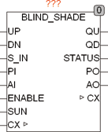
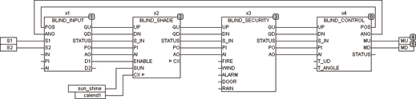

<!--
  Copyright (c) 2026 Hans Mühlbauer, Franz Höpfinger and others.

  This program and the accompanying materials are made available under the
  terms of the Eclipse Public License 2.0 which is available at
  https://www.eclipse.org/legal/epl-2.0

  SPDX-License-Identifier: EPL-2.0
-->

## Type	Funktionsbaustein

| | |
|:---|:---|
| **Input	UP** | BOOL (Eingang AUF) |
| **DN** | BOOL (Eingang AB) |
| **S_IN** | BYTE (ESR kompatibler Status Eingang) |
| **PI** | BYTE (Jalousiestellung im Automatikbetrieb) |
| **AI** | BYTE (Lamellenwinkel im Automatikbetrieb) |
| **SUN** | BOOL (Eingangssignal vom Sonnensensor) |
| **I/O	CX** | CALENDAR (aktuelle Zeit und Kalenderdaten) |
| **Output	QU** | BOOL (Motor Auf Signal) |
| **QD** | BOOL (Motor Ab Signal) |
| **STATUS** | BYTE (ESR kompatibler Status Ausgang) |
| **PO** | BYTE (Jalousiestellung im Automatikbetrieb) |
| **AO** | BYTE (Lamellenwinkel im Automatikbetrieb) |
| | BLIND_SHADE berechnet aus dem momentanen Sonnenstand den geeigneten Winkel der Lamellen um eine optimale Beschattung zu gewährleisten. Die Lamellen werden dem Sonnenstand nachgeführt, so dass über den Tagesverlauf immer Beschattung Sichergestellt ist. Mit dem Eingang ENABLE wird die Funktion freigeschaltet wenn gleichzeitig UP und DN (Automatik Modus) aktiv sind. Der Baustein wertet weiterhin den EINGANG SUN aus welcher durch TRUE Sonnenschein anzeigt. Wird SUN oder ENABLE FALSE so schaltet sich der Baustein automatisch ab. SUNRISE_OFFSET definiert mit welchem Zeitversatz nach Sonnenaufgang die Beschattung aktiv wird. SUNSET_PRESET legt fest mit welcher Zeitspanne vor Sonnenuntergang die Beschattung ausgesetzt wird. Die Beschattung ist dann Aktiv wenn SUN = TRUE, ENABLE = TRUE, UP = TRUE, DN = TRUE, der horizontale Sonnenwinkel sich innerhalb des Bereichs DIRECTION -  ANGLE_OFFSET und DIRECTION + ANGLE_OFFSET befindet und die Tageszeit sich innerhalb des durch SUNRISE, SUNRISE_OFFSET, SUNSET und SUNSET_PRESET definierten Zeitbereichs befindet. DIRECTION legt die Ausrichtung der Fassade fest, 180° bedeutet Fassade zeigt genau nach Süden, 90° liegt im Osten und 270° im Westen. Mit der Setup Variable SHADE_DELAY wird festgelegt wie lange nachdem SUN auf FALSE geht die Beschattung aktiv bleibt. Der Vorgabewert liegt bei 60 Sekunden. SHADE_DELAY Verhindert das bei Teilbewölkung die Jalousie dauernd auf und ab Fährt. Beim Einsatz von BLIND_SHADE ist darauf zu achten dass die Zykluszeit für den Baustein kleiner als T_ANGLE / 512 * SENS beträgt. SENS ist hierbei der SENS Wert des BLIND_CONTROLLERS. Wird die Zykluszeit zu groß so beginnt die Jalousie unregelmäßig hin und herzufahren. Die Setup Variable BLIND_POS legt fest wie weit die Jalousie bei Beschattung nach unten fährt. |
| **Die folgende Grafik beschreibt die Geometrie der Jalousie** |  |
| **Die folgende Grafik zeigt eine nach Süd-Ost gerichtete Fassade mit DIRECTION = 135°und ANGLE_OFFSET = 65°** |  |
| | Die Beschattungsfunktion berechnet den Lamellenwinkel so dass die Lamellen immer nur soweit geschlossen werden dass die Sonne abgeschattet wird, aber dennoch soviel Licht wie möglich in den Raum gelangt. Aus den Angaben DIRECTION und ANGLE_OFFSET wird berechnet wann der horizontale Einstrahlwinkel der Sonne eine Beschattung erfordert. Je nach Stärke der Mauer und Breite des Fensters kann der ANGLE_OFFSET so eingestellt werden das unnötige Beschattung vermieden wird. Mit DIRECTION wird die Himmelsrichtung der Fassade angegeben. Mithilfe der Abmessungen der Lamellen, Breite und Abstand in Millimeter (SLAT_WIDTH und SLAT_SPACING) wird berechnet  wie weit die Lamellen geneigt werden müssen um die Sonneneinstrahlung zu verhindern. Ziel ist es dabei die Lamellen nur soweit wie unbedingt nötig zu neigen damit optimale Lichtverhältnisse garantiert sind. Um bei Sonnenaufgang und Sonnenuntergang die Stimmung und Lichtverhältnisse nicht zu beeinflussen kann ein OFFSET vom Sonnenaufgang und ein PRESET vor dem Sonnenuntergang eingestellt werden. Mit einen OFFSET von 30 Minuten und einem PRESET von 60 Minuten wird zum Beispiel erst 30 Minuten nach Sonnenaufgang mit der Beschattung begonnen und bereits 60 Minuten vor Sonnenuntergang die Beschattung beendet. Der Eingang SUN des Moduls dient Dazu einen Sonnenintensitätssensor oder einen beliebigen geeigneten Sensor anzuschließen der die Funktion unterbricht wenn keine Sonnenstrahlung vorliegt. |
| **In der Folgenden Grafik wird die Abschattung verdeutlicht** |  |
| | Der Eingang S_IN und der Ausgang STATUS sind ESR kompatible Aus und Eingänge , über den Eingang S_IN melden vorgeschaltete Funktionen Ihren Status an das Modul, dieser Status wird an den Ausgang STATUS weitergeleitet, und eigene Statusmeldungen werden über STATUS Ausgegeben. BLIND_SHADE meldet am STATUS Ausgang den STATUS 151 wenn die Beschattungsfunktion aktiv ist. |
| **Das folgende Beispiel zeigt die Anwendung von BLIND_SHADE innerhalb einer Jalousiesteuerung** |  |
| **Setup	SUNRISE_OFFSET** | TIME (Verzögerung bei Sonnenaufgang) |
| **SUNSET_PRESET** | TIME (Verzögerung bei Sonnenuntergang) |
| **DIRECTION** | REAL (Fassadenausrichtung, 180° = Südfassade) |
| **ANGLE_OFFSET** | REAL (Horizontaler Öffnungswinkel für |
| | Beschattung) |
| **SLAT_WIDTH** | REAL (Breite der Lamellen in mm) |
| **SLAT_SPACING** | REAL (Abstand der Lamellen in mm) |
| **SHADE_DELAY** | TIME (Verzögerungszeit der Beschattung) |
| **SHADE_POS** | BYTE (Position bei Beschattung) |

