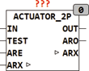

<!--
  Copyright (c) 2026 Hans Mühlbauer, Franz Höpfinger and others.

  This program and the accompanying materials are made available under the
  terms of the Eclipse Public License 2.0 which is available at
  https://www.eclipse.org/legal/epl-2.0

  SPDX-License-Identifier: EPL-2.0
-->

## Type	Funktionsbaustein

| | |
|:---|:---|
| **Input	IN** | BYTE (Steuereingang 0 - 255) |
| **TEST** | BOOL (startet Autorun wenn TRUE) |
| **ARE** | BOOL (Enable für Autorun) |
| **I/O	ARX** | BOOL (Autorun Signal Bus) |
| **Output	OUT** | BOOL (Schaltsignal für Ventil) |
| **ARO** | BOOL (TRUE wenn Autorun aktiv ist) |
| **Setup	CYCLE_TIME** | TIME (Taktrate des Ventils) |
| **SENS** | BYTE (Minimale und Maximale Eingangswerte) |
| **SELF_ACT_TIME** | TIME (Selbstbetätigungszeit) |
| **SELF_ACT_PULSE** | TIME (Schaltzeit bei Autorun) |
| **SELF_ACT_CYCLES** | INT (Anzahl Zyklen bei Autorun) |
| | ACTUATOR_2P ist ein Interface für 2-Punkt Aktuatoren wie z B. Magnetventile. Der 2-Punkt Aktuator kann nur Ein / Aus Schalten und deshalb wird der Eingangswert IN in ein Puls / Pause Signal am Ausgang OUT gewandelt. Die Zykluszeit (CYCLE_TIME) bestimmt die Schaltzeiten des Ausgangs. Damit ein Festkleben des Ventils durch langes ruhen verhindert wird, kann durch einstellen der Selbstbetätigungszeit (SELF_ACT_TIME) und der Anzahl der Selbstaktivierungszyklen (SELF_ACT_CYCLES) sowie der Impulsdauer (SELF_ACT_PULSE) bestimmt werden, nach welcher Zeit wie viele Schaltzyklen automatisch ausgeführt werden, um ein festkleben des Ventils zu verhindern. Nach Ablauf der Zeit SELF_ACT_TIME prüft der Baustein ob ARE = TRUE und ARX = FALSE sind und schaltet dann ARO für die Dauer der Selbstaktivierung auf TRUE. Gleichzeitig wird ARX auf TRUE gesetzt um zu verhindern das andere Bausteine die an ARX angeschlossen sind gleichzeitig in den Autorun gehen. Der Eingangswert IN kann von 0..255 variiert werden. Ist das Eingangssignal IN < SENS bleibt das Ventil dauernd geschlossen (OUT = FALSE) und IN > 255 - SENS bedeutet das Ventil ist dauernd offen (OUT = TRUE). |

