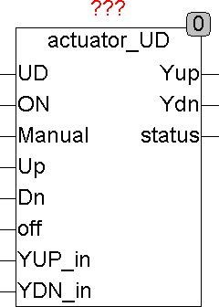

<!--
  Copyright (c) 2026 Hans Mühlbauer, Franz Höpfinger and others.

  This program and the accompanying materials are made available under the
  terms of the Eclipse Public License 2.0 which is available at
  https://www.eclipse.org/legal/epl-2.0

  SPDX-License-Identifier: EPL-2.0
-->

## Type	Funktionsbaustein

| | | |
|:---|:---|:---|
| **Input	UD** | BOOL (Richtungseingang in Auto Mode UP=TRUE) | |
| **ON** | BOOL (TRUE, wenn im Auto Mode) | |
| **MANUAL** | BOOL (TRUE, wenn Manual Mode) | |
| **UP** | BOOL (UP enable in Manual Mode) | |
| **DN** | BOOL (DN enable in Manual Mode) | |
| **OFF** | BOOL (Sicherheitsabschalter TRUE = Ausgänge FALSE) | |
| **YUP_IN** | BOOL (Rückführungseingang UP Relais) | |
| **YDN_IN** | BOOL (Rückführungseingang DN Relais) | |
| **Output	YUP** | BOOL (Ausgang für Richtung UP) | |
| **YDN** | BOOL (Ausgang für Richtung DN) | |
| **STATUS** | Byte (ESR kompatibler Status und Fehler Ausgang ) | |
| **Config	TON** | TIME (minimale Einschaltzeit) | |
| **TOFF** | TIME (minimale Ausschaltzeit) | |
| **OUT_RETURN** | BOOL (schaltet die Rückführeingänge YUP_In und | YDN_in ein) |
| **ACTUATOR_UD ist eine Wendeschützinterface mit Verriegelung und konfigurierbarem Timing. Mit zusätzlichen Rückführeingängen wird eine Aktivierung verhindert solange ein Relais klemmt. Der Baustein kennt einen Automatik und einen Handbetrieb. Im Automatikmodus (ON = TRUE und Manual = FALSE) entscheidet der Eingang UD über die Richtung und ON über Ein / Aus. Sobald der Manual Eingang TRUE wird beginnt der Manual Modus und die Ausgänge folgen nur den Eingängen UP und DN. UP und DN dürfen nie gleichzeitig TRUE sein, falls trotzdem werden beide Ausgänge FALSE. Mit einem Sicherheitsausschalteingang OFF können sowohl im Manual als auch im Automatik Modus jederzeit die Ausgänge abgeschaltet werden. Zwei Rückführeingänge YUP_IN und YDN_IN dienen dazu über separate Eingänge den Zustand der Schaltrelais auf den Baustein zurückzuführen und bei versagen eines Relais das aktivieren des anderen Ausgangs zu vermeiden. Dieser Fehler wird auch durch Fehlermeldungen am Ausgang STATUS gemeldet. Die Rückmeldefunktion ist jedoch nur verfügbar wenn die Config Variable OUT_RETURN auf TRUE gesetzt wird. Status meldet auch alle Aktivitäten des Bausteins um sie für eine Datenaufzeichnung zur Verfügung zu stellen. Der Status Ausgang ist ESR kompatibel und mit anderen ESR Modulen aus unserer Bibliothek kombinierbar. Der Ausgang Status meldet 2 Fehler** |  | |
| **1** | YUP kann nicht gesetzt werden weil YDN_IN TRUE ist. | |
| **2** | YDN kann nicht gesetzt werden weil YUP_IN TRUE ist. | |
| | Mit den Config Variablen TON und TOFF kann eine Mindeste Einschaltzeit und eine Mindeste Totzeit zwischen 2 Ausgangsimpulsen definiert werden um das Schalten großer Motoren oder Getriebe die ein An und Auslaufen benötigen zu ermöglichen. | |

| Manual | UP | DN | ON | UD | OFF | YUP | YDN | Status |
| --- | --- | --- | --- | --- | --- | --- | --- | --- |
| 1 | 0 | 0 | - | - | 0 | 0 | 0 | 102 |
| 1 | 1 | 0 | - | - | 0 | 1 | 0 | 103 |
| 1 | 0 | 1 | - | - | 0 | 0 | 1 | 104 |
| 1 | 1 | 1 | - | - | 0 | 0 | 0 | 102 |
| 0 | - | - | 1 | 1 | 0 | 1 | 0 | 111 |
| 0 | - | - | 1 | 0 | 0 | 0 | 1 | 112 |
| - | - | - | - | - | 1 | 0 | 0 | 101 |
| 1 | 0 | 0 | 0 | - | 0 | 0 | 0 | 110 |
| 0 | - | - | 0 | - | - | 0 | 0 | 110 |
