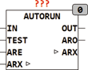
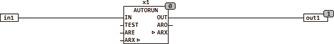

<!--
  Copyright (c) 2026 Hans Mühlbauer, Franz Höpfinger and others.

  This program and the accompanying materials are made available under the
  terms of the Eclipse Public License 2.0 which is available at
  https://www.eclipse.org/legal/epl-2.0

  SPDX-License-Identifier: EPL-2.0
-->

## Type	Funktionsbaustein

| | |
|:---|:---|
| **Input	IN** | BOOL (Schalteingang) |
| **TEST** | BOOL (aktiviert den Autorun Zyklus) |
| **ARE** | BOOL (Enable Autorun) |
| **Output	OUT** | BOOL (Ausgang für Verbraucher) |
| **ARO** | BOOL (TRUE wenn Autorun aktiv) |
| **AUTORUN überwacht die Laufzeit eines Verbrauchers und sorgt dafür, dass der Verbraucher an OUT nach Ablauf der Zeit TOFF mindestens für Die Zeit TRUN eingeschaltet wird. AUTORUN speichert die Laufzeit und schaltet den Ausgang erst dann ein wenn die Mindestlaufzeit TRUN innerhalb der Zeit TOFF unterschritten wird. Der Eingang IN ist der Schalteingang für den Ausgang OUT. Der Ausgang ARO signalisiert dass gerade Autorun aktiv ist. Der Eingang ARE muss TRUE sein um Autorun zu ermöglichen, an ARE kann ein Timer angeschlossen werden um Autorun zu bestimmten Zeiten zu starten. Der I/O ARX verhindert wenn TRUE einen Autorun, Autorun kann nur aktiv werden wenn ARI = FALSE. Wenn ARI = FLASE und die internen Timer abgelaufen sind schaltet der Baustein ARO und OUT auf TRUE und gleichzeitig setzt er ARI. Dieser Mechanismus kann auf verschiedene Weise genutzt werden** |  |
| | a) Ein TRUE am I/O ARX kann verhindern das Autorun stattfindet, es kann z.B. von einem externen Timer gesteuert werden und  so den Autorun nur während einer bestimmten Zeit erlauben. |
| | b) Die ARI Anschlüsse mehrerer Bausteine können zusammen geschaltet werden und somit wird verhindert das mehrere Bausteine gleichzeitig in den Autorun Modus schalten. Die Bausteine warten bis der erste Baustein mit Autorun fertig ist und dann wird der nächste Baustein beginnen. Dies ist sehr sinnvoll um bei einer größeren Anzahl von Verbrauchern zu verhindern dass alle gleichzeitig den Autorun durchführen und somit unnötig hohe Strombelastung erzeugen. |
| **Die Betriebszustände von AUTORUN** |  |
| **Eine simple Anwendung von Autorun mit Eingang und Ausgang** |  |
| | Im nächsten Beispiel werden Die Eingänge ARE (Autorun Enable) durch einen Timer Freigegeben, so dass Autorun nur zu bestimmten Zeiten ausgeführt wird. Der Autorun der Bausteine X1 und X2 startet hierbei gleichzeitig. |
| | Das folgende Beispiel zeigt 3 Autorun Bausteine die über ARI gegenseitig verriegelt sind, so dass immer nur ein Baustein in den Autorun gehen kann und der andere entsprechend warten muss. |
| **Setup	TRUN** | TIME (Mindestlaufzeit des Verbrauchers) |
| **TOFF** | TIME (Maximale Standzeit des Verbrauchers) |
| **I/O	ARX** | BOOL (Autorun Enable Signal) |

| IN | TEST | ARE | ARX | ARO | OUT |  |
| --- | --- | --- | --- | --- | --- | --- |
| X | 0 | - | - | - | X | normaler Betrieb |
| - | 1 | - | 1 | 1 | 1 | TEST startet Autorun Zyklus |
| - | 0 | 1 | 1 | 0 >> 1 | 1 | Autorun Zyklus ist aktiv |
