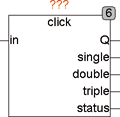
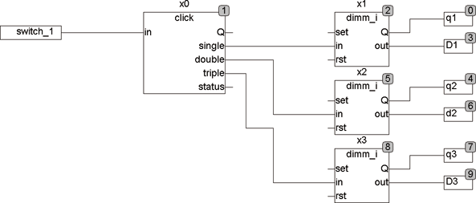
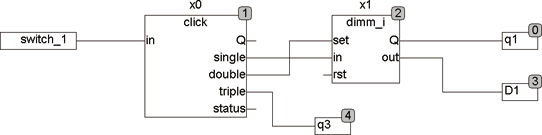

<!--
  Copyright (c) 2026 Hans Mühlbauer, Franz Höpfinger and others.

  This program and the accompanying materials are made available under the
  terms of the Eclipse Public License 2.0 which is available at
  https://www.eclipse.org/legal/epl-2.0

  SPDX-License-Identifier: EPL-2.0
-->

## Type	Funktionsbaustein

| | |
|:---|:---|
| **Input	IN** | BOOL (Steuereingang für Taster) |
| **Output	Q** | BOOL (Schaltausgang) |
| **SINGLE** | BOOL (Ausgang für einfachen Tastendruck) |
| **DOUBLE** | BOOL (Ausgang für doppelten Tastendruck) |
| **TRIPLE** | BOOL (Ausgang für dreifachen Tastendruck) |
| **STATUS** | BYTE (ESR kompatibler Status Ausgang) |
| **Setup	T_DEBOUNCE** | TIME (Entprellzeit für Taster) |
| **T_SHORT** | TIME (Maximale Zeit für kurzen Impuls) |
| **T_PAUSE** | TIME (Maximale Pause zwischen 2 Impulsen) |
| **T_RESetup** | TIME (Rekonfigurationszeit) |
| | CLICK ist ein Tastinterface das sich selbsttätig auf den angeschlossenen Taster einstellt. Wird ein Taster angeschlossen, so erkennt CLICK selbst, ob es ein Öffner oder Schließer ist und wertet dann nur die jeweils erste Flanke aus. Mit der Setup-Variable T_DEBOUNCE wird die Entprellzeit des Tasters festgelegt. Sie ist standardmäßig auf 10ms voreingestellt. Die Zeit T_RESetup wird verwendet, um zu entscheiden ob ein Schließer oder Öffner am Eingang IN angeschlossen ist. Bleibt der Eingang länger als diese Zeit in einem Zustand, so wird dies als Ruhestellung angenommen. Der Vorgabewert für T_RESetup beträgt 1 Minute. Mit kurz aufeinander folgenden Impulsen wird ein einfacher, doppelter oder dreifacher Puls ausgewertet und schaltet entsprechend den Ausgang SINGLE, DOUBLE oder TRIPLE ein. Ist der Puls länger als die Setup-Zeit T_SHORT oder eine Pause zwischen 2 Impulsen länger als T_PAUSE, so wird die Puls-Sequenz unterbrochen und der entsprechende Ausgang gesetzt, bis der Eingangspuls wider inaktiv wird. Der Ausgang Q entspricht dem Eingangsimpuls. Jedoch ist er immer High-aktiv. Ein ESR kompatibler Status Ausgang meldet Zustandsänderungen an nachfolgende ESR kompatible Auswertemodule. Mit kurzen Impulsen wird der Ausgang SINGLE (ein Puls), DOUBLE (2 Impulse) oder TRIPLE (3 Impulse) ausgewählt. Der entsprechende Ausgang bleibt mindestens einen Zyklus aktiv und maximal solange wie der Eingang IN aktiv bleibt. |

**Beispiel:**

Beispiel 1 zeigt eine Anwendung von CLICK mit 3 nachfolgenden Dimm Bausteinen. Analog können auch bis zu 3 Schalter oder eine Mischung aus Dimmern  oder Schaltern benutzt werden.

Beispiel 2 zeigt CLICK mit einem Dimmer, wobei sich der Dimmer wie ein Dimmer ohne CLICK verhält, jedoch ein kurzer Doppelklick den Ausgang des Dimmers sofort auf 100% setzt und ein Dreifachklick als weiterer Schaltausgang zur Verfügung steht.

| Status |  |
| --- | --- |
| 110 | Eingang inaktiv |
| 111 | Ausgang SINGLE aktiviert |
| 112 | Ausgang DOUBLE aktiviert |
| 113 | Ausgang TRIPLE aktiviert |
