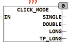

<!--
  Copyright (c) 2026 Hans Mühlbauer, Franz Höpfinger and others.

  This program and the accompanying materials are made available under the
  terms of the Eclipse Public License 2.0 which is available at
  https://www.eclipse.org/legal/epl-2.0

  SPDX-License-Identifier: EPL-2.0
-->

## CLICK_MODE

| | |
|:---|:---|
| **Type** | Funktionsbaustein |
| **Input	IN** | BOOL (Steuereingang für Taster) |
| **Output	SINGLE** | BOOL (Ausgang für einfachen Tastendruck) |
| **DOUBLE** | BOOL (Ausgang für doppelten Tastendruck) |
| **LONG** | BOOL (Ausgang für einen langen Tastendruck) |
| **TP_LONG** | BOOL (Impuls wenn Langer Tastendruck startet) |
| **Setup	T_LONG** | TIME (Dekodierzeit für Langen Tastendruck) |
| | CLICK_MODE ist ein Taster Interface das sowohl einfachen Klick, Doppelklick oder Lange Tastendrücke dekodiert. Mit kurzen Impulsen wird ein einfacher oder Doppelklick dekodiert und schaltet entsprechend die Ausgänge SINGLE oder DOUBLE für jeweils einen Zyklus ein. Ist der Puls länger als die T_LONG, so wird der Ausgang TP_LONG für einen Zyklus auf TRUE gesetzt und der Ausgang LONG bleibt solange TRUE bis der Eingang IN wieder auf FALSE geht. |

