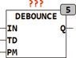

<!--
  Copyright (c) 2026 Hans Mühlbauer, Franz Höpfinger and others.

  This program and the accompanying materials are made available under the
  terms of the Eclipse Public License 2.0 which is available at
  https://www.eclipse.org/legal/epl-2.0

  SPDX-License-Identifier: EPL-2.0
-->

## Type	Funktionsbaustein

| | |
|:---|:---|
| **Input	IN** | BOOL (Eingangssignal vom Schalter oder Taster) |
| **TD** | TIME (Entprellzeit) |
| **PM** | BOOL (Betriebsart TRUE = Impulsbetrieb) |
| **Output	Q** | BOOL (Ausgangssignal) |
| | DEBOUNCE kann das Signal von einem Schalter oder Taster entprellen und am Ausgang Q entprellt bereitstellen. Wenn PM = FALSE folgt der Ausgang Q dem entprellten Eingangsignal IN, ist PM = TRUE wird am Eingang In eine steigende Flanke detektiert und der Ausgang Q bleibt nur für einen Zyklus auf TRUE. Die Entprellzeit für den Eingang IN wird mit der Zeit TD eingestellt. |

