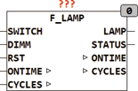
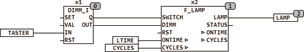

<!--
  Copyright (c) 2026 Hans Mühlbauer, Franz Höpfinger and others.

  This program and the accompanying materials are made available under the
  terms of the Eclipse Public License 2.0 which is available at
  https://www.eclipse.org/legal/epl-2.0

  SPDX-License-Identifier: EPL-2.0
-->

## Type	Funktionsbaustein

| | |
|:---|:---|
| **Input	SWITCH** | BOOL (Schalteingang vom Dimmer) |
| **DIMM** | BYTE (Eingang vom Dimmer) |
| **RST** | BOOL (Eingang zum Rücksetzen des Zählers) |
| **Output	LAMP** | BYTE (Dimmer Ausgang) |
| **STATUS** | BYTE (ESR kompatibler Status Ausgang) |
| **I/O	ONTIME** | UDINT (Betriebszeit in Sekunden) |
| **CYCLES** | UDINT (Anzahl der Schaltzyklen des Leuchtmittels) |
| **Setup	T_NO_DIMM** | UINT (Sperrzeit für Dimmer in Stunden) |
| **T_Maintenance** | UINT (Meldezeit für Lampenwechsel in |
| | Stunden) |
| | F_LAMP ist ein Lampeninterface für Leuchtstofflampen. Der Ausgang LAMP folgt dem Eingang DIMM und SWITCH. Wenn Dimm nicht beschaltet wird ist die Vorgabe 255 und der Ausgang LAMP schaltet zwischen 0 und 255 abhängig von SWITCH. Die Ausgänge ONTIME und CYCLES zählen die Betriebszeit des Leuchtmittels in Sekunden und die Schaltzyklen. Beide Werte werden extern gespeichert und können  Remanent oder Persistent gespeichert werden, weitere Infos hierzu finden Sie beim Baustein ONTIME. Ein TRUE am Eingang RST setzt diese beiden Werte auf 0 zurück. Mit der Setup-Variablen T_NO_DIMM wird festgelegt, nach welcher Betriebsdauer eines neuen Leuchtmittels mit dem Dimmen begonnen werden darf. Dieser Wert ist, wenn er nicht vom Anwender anders eingestellt wird, auf 100 Stunden voreingestellt. Leuchtstofflampen dürfen während der ersten 100 Betriebsstunden nicht in Ihrer Leuchtkraft reduziert werden, sonst wird Ihre Lebensdauer drastisch verkürzt. Durch einen RST beim Lampenwechsel verhindert dieser Baustein das Dimmen in der Anfangsphase. Der Ausgang Status ist ESR kompatibel und kann Betriebszustände melden, aber auch eine Meldung zum Lampenwechsel absetzen. Die  voreingestellte Zeit für T_MAINTENANCE beträgt, falls vom Anwender nicht anders eingestellt, 15000 Stunden. Wird T_Maintenance auf 0 gesetzt so wird keine Meldung zum Lampenwechsel generiert. |
| **Das folgende Beispiel zeigt die Anwendung des Bausteins F_LAMP in Verbindung mit DIMM_I** |  |

| Status |  |
| --- | --- |
| 110 | Lampe ausgeschaltet |
| 111 | Lampe eingeschaltet Dimmen nicht erlaubt |
| 112 | Lampe eingeschaltet Dimmen erlaubt |
| 120 | Aufforderung zum Lampenwechsel |
