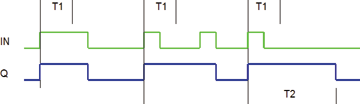

<!--
  Copyright (c) 2026 Hans Mühlbauer, Franz Höpfinger and others.

  This program and the accompanying materials are made available under the
  terms of the Eclipse Public License 2.0 which is available at
  https://www.eclipse.org/legal/epl-2.0

  SPDX-License-Identifier: EPL-2.0
-->

## PULSE_T

| | |
|:---|:---|
| **Type** | Funktionsbaustein |
| **Input	IN** | BOOL (Eingangspuls) |
| **T1** | TIME (Minimalzeit) |
| **T2** | TIME (Maximalzeit) |
| **Output	Q** | BOOL (Ausgangspuls) |
| | PULSE_T erzeugt einen Ausgangsimpuls der Länge T2 wenn der Eingang IN kürzer als T1 auf TRUE geht. Bleibt der Eingang IN länger als T1 auf TRUE so folgt der Ausgang Q dem Eingang IN und geht zeitgleich mit IN wieder auf FALSE. Bleibt IN länger als die Zeit T2 auf TRUE wird der Ausgang nach Ablauf der Zeit T2 automatisch auf FALSE zurückgesetzt. Eine weiterer Impuls an IN während der Ausgang TRUE ist setzt den Ausgang mit der fallenden Flanke von IN auf FALSE. liegt der Eingang IN länger als die Zeit T2 auf TRUE so wird der Ausgang Q nach Ablauf der Zeit T2 automatisch auf FALSE gesetzt. |
| | Das folgende Zeitdiagramm zeigt einen Eingangsimpuls der länger als T1 anliegt und den Ausgang Q der dem Eingang folgt. Anschließend wird am Eingang IN ein kurzer Puls (kürzer als T1) erzeugt und der Ausgang bleibt aktiv bis Ihn ein weiterer Impuls an IN wieder löscht. Ein weiterer kurzer Impuls am Eingang IN setzt den Ausgang auf TRUE bis dieser nach Ablauf der Zeit T2 selbsttätig gelöscht wird. |

