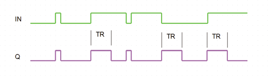

<!--
  Copyright (c) 2026 Hans Mühlbauer, Franz Höpfinger and others.

  This program and the accompanying materials are made available under the
  terms of the Eclipse Public License 2.0 which is available at
  https://www.eclipse.org/legal/epl-2.0

  SPDX-License-Identifier: EPL-2.0
-->

## Type	Funktionsbaustein

| | |
|:---|:---|
| **Input	IN** | BOOL (Taster Eingang) |
| **TD** | TIME (Entprellzeit für den Eingang) |
| **TR** | TIME (Rekonfigurationszeit) |
| **Output	Q** | BOOL (Schaltausgang) |
| | SW_RESetup ist ein intelligentes Taster Interface, es kann den Eingang entprellen und erkennt selbständig ob ein Öffner oder Schließer am Eingang IN angeschlossen ist. Wird am Eingang IN ein Öffner erkannt, so wird der Ausgang Q invertiert. Wird am Eingang IN ein Schalter angeschlossen, so erzeugt der Baustein bei jedem Zustandswechsel des Schalters einen Puls mit der Länge TR. TD ist die Entprellzeit und TR die Rekonfigurationszeit. immer Dann wenn der Eingang IN länger als die Rekonfigurationzeit in einem Zustand bleibt geht der Ausgang auf FALSE und wird somit beim nächsten Impuls an Eingang in einen High aktiven Impuls ausgeben. In der praktischen Installationstechnik kann dies von großem Vorteil sein wenn Schalter manchmal als Öffner und manchmal als Schließer angeschlossen sind. |
| **Die folgende Grafik verdeutlicht die Funktionsweise des Bausteins** |  |

