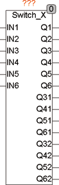

<!--
  Copyright (c) 2026 Hans Mühlbauer, Franz Höpfinger and others.

  This program and the accompanying materials are made available under the
  terms of the Eclipse Public License 2.0 which is available at
  https://www.eclipse.org/legal/epl-2.0

  SPDX-License-Identifier: EPL-2.0
-->

## Type	Funktionsbaustein

| | |
|:---|:---|
| **Input	IN1..6** | BOOL (Taster Eingänge) |
| **Output	Qx** | BOOL (Schaltausgänge) |
| **Setup	T_DEBOUNCE** | TIME (Entprellzeit für Taster) |
| | SWITCH_X ist ein Interface für bis zu 6 Taster. Die einzelnen Taster werden mit der Entprellzeit T_DEBOUNCE entprellt und schalten die jeweiligen Ausgänge Q1 bis Q6. IN3 bis IN6 werden direkt auf die Ausgänge geschaltet, wenn sie alleine betätigt werden. IN1 und IN2 erzeugen einen Puls für einen Zyklus nachdem sie betätigt wurden. Wird während IN1 oder IN2 betätigt ist, einer der Eingänge IN3 bis IN 6 betätigt, so wird kein Ausgangsimpuls an Q1 bis Q6 erzeugt, sondern es wird der entsprechende Ausgang Q31 bis Q62 aktiviert. Q42 wird zum Beispiel dann aktiviert, wenn IN4 betätigt wird, während IN2 betätigt ist. Q2 und Q4 werden dann nicht aktiv. |
| | SWITCH_X erlaubt es also auf den Eingängen IN3 bis IN6 eine Dreifachbelegung zu Realisieren und diese durch Betätigen von IN1 oder IN2 und einem weiteren Eingang auszuwählen. |

