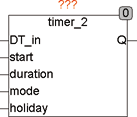

<!--
  Copyright (c) 2026 Hans Mühlbauer, Franz Höpfinger and others.

  This program and the accompanying materials are made available under the
  terms of the Eclipse Public License 2.0 which is available at
  https://www.eclipse.org/legal/epl-2.0

  SPDX-License-Identifier: EPL-2.0
-->

## TIMER_2

| | |
|:---|:---|
| **Type** | Funktionsbaustein |
| **Input	DT_IN** | DATE_TIME (Datum Zeit Eingang) |
| **START_TIME** | TOD (Startzeit) |
| **DURATION** | TIME (Zeitdauer des Ausgangssignals) |
| **MODE** | BYTE (Tagesauswahl) |
| **HOLIDAY** | BOOL (Feiertagssignal) |
| **Output	 Q** | BOOL (Schaltausgang) |
| | TIMER_2 erzeugt ein Ausgangsereignis mit einer programmierbaren Dauer. DT_IN liefert dem Baustein die Lokalzeit. START_TIME und DURATION legt die Tageszeit und die Dauer des Ereignisses fest. Der Eingang Mode legt fest, wie oft und an welchem Tagen das Ereignis erzeugt werden soll. HOLIDAY ist ein Eingangssignal, das anzeigt ob der aktuelle Tag ein Feiertag ist. Dieses Signal kann vom Baustein HOLIDAY erzeugt werden. |

**Beispiel:**

Beispiel für die Anwendung von TIMER_2:

Das Beispiel zeigt die System-Routine (in diesem Fall für einen Wago Controller), die die interne Uhr ausliest und DATE_TIME für TIMER_2 und HOLIDAY bereitstellt. HOLIDAY liefert die Feiertagsinformation an TIMER_2. TIMER_2 liefert in diesem Beispiel an Wochenenden (Samstag und Sonntag), sowie an Feiertagen (Mode = 22) ein Ausgangssignal jeweils um 12:00 Mittags für eine Dauer von 30 Minuten. TIMER_2 erzeugt limitiert von der Zykluszeit immer die exakte DURATION am Ausgang. TIMER_2 merkt sich an welchen Tag er den letzten Ausgangsimpuls erzeugt hat, so dass sichergestellt ist das nur ein Impuls pro Tag erzeugt wird.

| MODE | Q |
| --- | --- |
| 0 | Es wird kein Ausgangssignal erzeugt |
| 1 | nur am Montag |
| 2 | nur am Dienstag |
| 3 | nur am Mittwoch |
| 4 | nur am Donnerstag |
| 5 | nur am Freitag |
| 6 | nur am Samstag |
| 7 | nur am Sonntag |
| 11 | jeden Tag |
| 12 | alle 2 Tage |
| 13 | alle 3 Tage |
| 14 | alle 4 Tage |
| 15 | alle 5 Tage |
| 16 | alle 6 Tage |
| 20 | Wochentage (Montag bis Freitag) |
| 21 | Samstag und Sonntag |
| 22 | Arbeitstage (Wochentage ohne Feiertage) |
| 23 | Feiertage und Wochenende |
| 24 | Nur an Feiertagen |
| 25 | Erster Tag im Monat |
| 26 | Letzter Tag im Monat |
| 27 | Letzter Tag im Jahr (31. Dezember) |
| 28 | Erster Tag im Jahr (1. Januar) |
