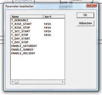
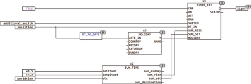

<!--
  Copyright (c) 2026 Hans Mühlbauer, Franz Höpfinger and others.

  This program and the accompanying materials are made available under the
  terms of the Eclipse Public License 2.0 which is available at
  https://www.eclipse.org/legal/epl-2.0

  SPDX-License-Identifier: EPL-2.0
-->

## TIMER_EXT

| | |
|:---|:---|
| **Type** | Funktionsbaustein |
| **Input	ENA** | BOOL (Baustein Enable, default TRUE!) |
| **ON** | BOOL (zwingt den Ausgang Q auf TRUE) |
| **OFF** | BOOL (zwingt den Ausgang Q auf FALSE) |
| **MAN** | BOOL (Steuereingang wenn ON = OFF = TRUE) |
| **SWITCH** | BOOL (Eingang für Taster) |
| **DT_IN** | DATETIME (Eingang für Datum und Tageszeit) |
| **SUN_SET** | TOD (Zeit des Sonnenuntergangs) |
| **SUN_RISE** | TOD (Zeit des Sonnenaufgangs) |
| **HOLIDAY** | BOOL (Eingang für Feiertagsmodul) |
| **Output	Q** | BOOL (Schaltausgang) |
| **Status** | BYTE (ESR kompatibler Status Ausgang) |
| **TIMER_EXT ist ein Timer speziell für Außenbeleuchtungen oder andere Verbraucher, die während der Dämmerung geschaltet werden sollen. Der Ausgang Q kann zu festen Tageszeiten ein-/ausgeschaltet werden, zusätzlich können Zeitspannen festgelegt werden, zu denen Q vor der Dämmerung ein- und nach der Dämmerung automatisch wieder ausgeschaltet wird. Ein zusätzlicher Eingang SWITCH schaltet den Ausgang unabhängig von der Tageszeit ein/aus. Die Eingänge ENA, ON, OFF und MAN erlauben eine ausführliche automatische und manuelle Steuerung des Ausgangs. Die folgende Tabelle gibt detaillierte Informationen über die Betriebszustände des Bausteins** |  |
| **Die Setup Variablen ENABLE_SUNDAY, SATURDAY und HOLIDAY definieren die Aktivität des Bausteins an Samstagen, Sonntagen und Feiertagen. Sollen Feiertage durch diesen Baustein berücksichtigt werden, muss am Eingang HOLIDAY der Baustein HOLIDAY aus der Bibliothek angeschlossen werden. Dieser Baustein signalisiert mit einem TRUE, dass der aktuelle Tag  ein Feiertag ist. Die Setup Variablen T_SET_START, T_SET_STOP, T_RISE_START, T_RISE_STOP, T_DAY_START und T_DAY_STOP legen die Schaltzeiten fest. Ein T#0s bzw. TOD#00** | 00 als übergebener Wert deaktiviert die jeweilige  Schaltzeit. Das bedeutet, dass z.B. T_SET_START (Einschaltzeitspanne vor Sonnenuntergang) nur dann einschaltet, wenn sie auf mindestens 1 Sekunde (T#1s) eingestellt ist. Der Baustein schaltet zum Zeitpunkt T_DAY_START den Ausgang Q ein und zum Zeitpunkt T_DAY_STOP wieder aus. Steht eine der beiden Zeiten (T_DAY_START oder T_DAY_STOP) auf TOD#00:00, wird der entsprechende Schaltvorgang nicht ausgeführt. Der Baustein schaltet die Zeitspanne T_RISE_START vor Sonnenaufgang (SUN_RISE) ein und  die Zeitspanne T_RISE_STOP nach Sonnenaufgang wieder aus. Gleiches gilt für die Zeiten zum Sonnenuntergang. |
| **Setup	T_DEBOUNCE** | TIME (Entprellzeit für den Eingang SWITCH) |
| **T_RISE_START** | TIME (Einschaltzeit vor Sonnenaufgang) |
| **T_RISE_STOP** | TIME (Ausschaltzeit nach Sonnenaufgang) |
| **T_SET_START** | TIME (Einschaltzeit vor Sonnenuntergang) |
| **T_SET_STOP** | TIME (Ausschaltzeit nach Sonnenuntergang) |
| **T_DAY_START** | TOD (Einschaltzeit nach Tageszeit) |
| **T_DAY_STOP** | TOD (Ausschaltzeit nach Tageszeit) |
| **ENABLE_SATURDAY** | BOOL (aktiv an Samstagen wenn TRUE) |
| **ENABLE_SUNDAY** | BOOL (aktiv an Sonntagen wenn TRUE) |
| **ENABLE_HOLIDAY** | BOOL (aktiv an Feiertagen wenn TRUE) |

| ENA | ON | OFF | MAN | SWITCH | Timer | Q | STATUS |
| --- | --- | --- | --- | --- | --- | --- | --- |
| L | - | - | - | - | - | L | 104 |
| H | H | L | - | - | - | H | 101 |
| H | L | H | - | - | - | L | 102 |
| H | H | H | X | - | - | MAN | 103 |
| H | L | L | - |  | - | NOT Q | 110 |
| H | L | L | - | - | TOD = T_DAY_START | H | 111 |
| H | L | L | - | - | TOD = T_DAY_STOP | L | 112 |
| H | L | L | - | - | TOD = SUN_RISE - T_RISE_START | H | 113 |
| H | L | L | - | - | TOD = SUN_RISE + T_RISE_STOP | L | 114 |
| H | L | L | - | - | TOD = SUN_SET - T_SET_START | H | 115 |
| H | L | L | - | - | TOD = SUN_SET + T_SET_STOP | L | 116 |
