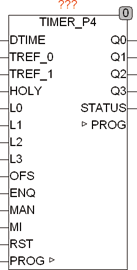

<!--
  Copyright (c) 2026 Hans Mühlbauer, Franz Höpfinger and others.

  This program and the accompanying materials are made available under the
  terms of the Eclipse Public License 2.0 which is available at
  https://www.eclipse.org/legal/epl-2.0

  SPDX-License-Identifier: EPL-2.0
-->

## TIMER_P4

| | |
|:---|:---|
| **Type** | Funktionsbaustein |
| **Input	DTIME** | DATE_TIME (Datum Zeit Eingang) |
| **TREF_0** | TOD (Referenzzeit 0) |
| **TREF_1** | TOD (Referenzzeit 1) |
| **HOLY** | BOOL (Feiertagseingang) |
| **L0..L3** | BOOL (Logische Eingänge) |
| **OFS** | INT (Kanal Offset) |
| **ENQ** | BOOL (Wenn ENQ = FALSE bleiben alle Ausgänge FALSE) |
| **MAN** | BOOL (Umschalter für Handbetrieb) |
| **MI** | BYTE (Kanalwahl bei Handbetrieb) |
| **RST** | BOOL (Asynchroner Reset) |
| **I/O	PROG** | ARRAY[0..63] OF TIMER_EVENT (Programmdaten) |
| **Output	Q0..Q3** | BOOL (Schaltausgänge) |
| **STATUS** | BYTE (ESR kompatibler Status Ausgang) |
| | TIMER_P4 ist ein universell programmierbarer Timer der ein Fülle von Möglichkeiten bietet. Neben Ereignissen zu festen Zeiten können auch Ereignisse in Abhängigkeit von externen Zeiten wie zum Beispiel Sonnen- Auf oder Sonnen- Untergang programmiert werden. Zusätzlich zur zeitlichen Programmierung können alle Ausgänge flexibel mit logischen Eingängen verknüpft werden. Mit maximal 63 unabhängig programmierbaren Ereignissen stehen dem Anwender praktisch unbegrenzte Möglichkeiten zur Verfügung. |
| | Die Programmierung des Timers erfolgt über ein ARRAY[0..63] OF TIMER_EVENT. Es können dabei beliebig viele Ereignisse je Kanal und auch überlappende Ereignisse Erzeugt werden. |
| **Die Datenstruktur TIMER_EVENT enthält folgende Felder** |  |
| | Im Datenfeld CHANNEL wird der für das Ereignis relevante Kanal spezifiziert, falls mehrere Kanäle gleichzeitig geschaltet werden sollen müssen je Kanal separate Ereignisse programmiert werden. Der TYP des Ereignisses legt fest welche Art von Ereignis programmiert werden soll, siehe hierzu die Übersicht in der folgenden Tabelle. DAY legt entweder als Bitmaske die Wochentage (Bit7 = MO, BIT0 = SO) fest, oder den Tag im Monat / Jahr oder eine je nach Ereignistyp definierte andere Nummer beziehungsweise Anzahl. START ist die jeweilige Anfangszeit (TIMEOFDAY) des Ereignisses, bei Ereignissen in Abhängigkeit einer externen Zeit kann START auch eine Zeitverschiebung definieren. Die Dauer legt unabhängig vom Typ des Ereignisses fest wie lange das Ereignis andauert. Wurde ein Ereignis gestartet merkt sich der Timer in der Datenstruktur den jeweiligen Tag so dass jedes Ereignis maximal einmal pro Tag gestartet wird. Sollen mehrere Ereignisse je Tag und Kanal definiert werden, können diese durch mehrere unabhängige Ereignisse programmiert werden. LAND und LOR definieren Logische Masken für zusätzliche Logische Verknüpfungen, eine detaillierte Beschreibung der möglichen Zustandsverknüpfungen findet sich weiter unten im Text. |
| | Der Timer hat einen zusätzlichen manuellen Eingang der es erlaubt Ausgänge Manuell zu überschreiben. Wenn MAN = TRUE ist werden die 4 untersten Bits des Eingangs MI auf die Ausgänge Q geschaltet. Der Eingang ENQ ist ein Freigabeeingang und muss für normalen Betrieb auf TRUE stehen, wird ENQ auf FALSE gestellt, bleiben alle Ausgänge auf FALSE. Der Baustein kann jederzeit mittels des asynchronen Eingangs RST zurückgesetzt werden, dabei werden alle laufenden Ereignisse gelöscht. Der Eingang OFS wird nur dann benützt wenn mehrere TIMER Bausteine kaskadiert werden, der WERT an OFS legt dann fest welche Kanalnummer der erste Ausgang des Bausteins hat. Wird OFS beispielsweise auf 4 gesetzt so reagiert der entsprechende Baustein nicht mehr auf die Kanalnummern 0..3 sondern auf die Kanäle 4..7. Somit lassen sich mehrere Bausteine einfach kaskadieren. |
| | Der Ausgang STATUS ist ein ESR kompatibler Status Ausgang der die Betriebszustände des Bausteins meldet. |
| | STATUS = 100 (Der Baustein ist disabled, ENQ = FALSE) |
| | STATUS = 101 (Handbetrieb, MAN = TRUE) |
| | STATUS = 102 (automatischer Betrieb) |
| **Das folgende Beispiel zeigt 2 kaskadierte Timer** |  |
| **Blockschaltbild des Timers** |  |
| | Tritt ein programmiertes Ereignis ein so wird der entsprechende Timer des Angesprochenen Kanals mit der vordefinierten Zeitdauer gestartet. Der Kanalausgang kann durch logisches UND mit bis zu 4 Eingängen L0..L3 verknüpft werden, es werden dabei nur die Eingänge verknüpft die in der Ereignismaske LAND mit einer 1  Definiert sind. enthält die Maske LAND keine 1 (2#00000000) dann wird kein Eingang mit dem Ausgang verknüpft. Enthält die Maske LAND zum Beispiel 2#00001001) dann wird das Ausgangssignal des Timers mit den Logischen Eingängen L0 und L3 per AND verknüpft. Der Ausgang wird in diesem Fall nur Dann TRUE wenn sowohl ein Ereignis den Timer gestartet hat und gleichzeitig auch L0 und L3 TRUE sind. Nach der UND Verknüpfung kann der Ausgang noch zusätzlich mit beliebigen logischen Eingängen in der selben Weise mittels der Maske LOR OR verknüpft werden. |
| **Folgende Ereignisse können Programmiert werden** |  |
| **Ereignistypen** |  |
| | 1. tägliches Ereignis |
| | bei einem täglichen Ereignis wird lediglich Kanalnummer, Startzeit und Dauer des Ereignisses Programmiert. Das Feld DAY hat keine Bedeutung. |
| | 2. Ereignis an selektierten Wochentagen |
| | bei diesem Ereignis wird der Timer an selektierbaren Wochentagen gestartet. Im Feld DAY wird dabei über eine Bitmaske festgelegt an welchen Wochentagen das Ereignis zu starten ist. Montag = Bit 6, .... Sonntag = Bit 0. Das Ereignis wird nur an den Wochentagen gestartet wenn das entsprechende Bit im Feld DAY TRUE ist. |
| | 3. Ereignis alle N Tage |
| | hierbei wird nach Ablauf von N Tagen das definierte Ereignis gestartet. Im Feld DAY wird dabei angegeben nach wie vielen Tagen das Ereignis gestartet wird. N=3 bedeutet das das Ereignis jeden 3ten Tag gestartet wird. N kann hierbei Werte von 1..255 annehmen. |
| | 10. wöchentliches Ereignis |
| **hierbei wird an einem bestimmten Tag in der Woche das Ereignis gestartet, der entsprechende Tag wird im Feld DAY festgelegt** | 1 = Montag.....7 = Sonntag. |
| | 20. monatliches Ereignis |
| | Bei monatlichen Ereignissen wird im Feld DAY der entsprechende Tag des Monats an dem das Ereignis stattfinden soll festgelegt. DAY = 24 bedeutet das das Ereignis jeweils am 24. eines Monats gestartet wird. |
| | 21. Ende des Monats |
| | Da Monate keine feste Länge haben ist es Sinnvoll auch ein Ereignis am letzten Tag eines Monats generieren zu können. In diesen Mode hat DAY keine Bedeutung. |
| | 30. jährliches Ereignis |
| | Bei jährlichen Ereignissen wird im Feld DAY der entsprechende Tag des Jahres an dem das Ereignis stattfinden soll festgelegt. DAY = 33 bedeutet das das Ereignis jeweils am 33. Tag eines Jahres gestartet wird, was dem dem 2. Februar entspricht. |
| | 31. Ende des Jahres |
| | Da Jahre keine feste Länge haben ist es Sinnvoll auch ein Ereignis am letzten Tag eines Jahres generieren zu können. In diesen Mode hat DAY keine Bedeutung. Das Ereignis wird immer am 31. Dezember erzeugt. |
| | 40. Ereignis an Schalttagen |
| | Dieses Ereignis wird nur am 29. Februar, also nur in einem Schaltjahr generiert. DAY hat hierbei keine Bedeutung. |
| | 41. Ereignis an Feiertagen |
| | Dieses Ereignis wird nur dann erzeugt wenn der Eingang HOLY = TRUE ist. An diesem Eingang muss zu diesem Zweck der Baustein HOLDAY aus der Bibliothek angeschlossen werden. Wird dieser Mode nicht genutzt kann der Eingang HOLY offen bleiben. Das Feld DAY hat hierbei keine Bedeutung. |
| | 42. Ereignis an Feiertagen und Wochenenden |
| | Dieses Ereignis wird erzeugt wenn der Eingang HOLY = TRUE ist, oder ein Samstag oder Sonntag vorliegt. Am Eingang HOLY muss zu diesem Zweck der Baustein HOLDAY aus der Bibliothek angeschlossen werden. Wird dieser Mode nicht genutzt kann der Eingang HOLY offen bleiben. Das Feld DAY hat hierbei keine Bedeutung. |
| | 43. Ereignis an Werktagen |
| | Dieses Ereignis wird nur an den Wochentagen Montag bis Freitag erzeugt. Das Feld DAY hat hierbei keine Bedeutung. |
| | 50. Ereignis nach externer Zeit |
| **hierbei wird ein tägliches Ereignis erzeugt das von einer externen Zeit abhängig ist. IM Feld START wird hierbei nicht die Startzeit selbst, sondern der Offset von der externen Zeit festgelegt. Im Feld DAY wird angegeben welche externe Zeit als Referenz herangezogen wird. DAY = 0 bedeutet TREF_0 und DAY = 1 entspricht TREF_1. Ein Ereignis nach externer Zeit ist zum Beispiel ein Ereignis 1 Stunde nach Sonnenuntergang. In diesem Fall würde an TREF_1  (DAY muss hierzu auf 1 stehen) die Zeit des Sonnenuntergangs eingespeist werden, und im Feld START die Zeit 01** | 00 (eine Stunde Offset) angegeben. Die Zeiten für Sonnen- Auf und Sonnen- Untergang können aus dem Baustein SUN_TIME aus der Bibliothek eingespeist werden. |
| | 51. Ereignis vor externer Zeit |
| **hierbei wird ein tägliches Ereignis erzeugt das von einer externen Zeit abhängig ist. IM Feld START wird hierbei nicht die Startzeit selbst, sondern der Offset vor der externen Zeit festgelegt. Im Feld DAY wird angegeben welche externe Zeit als Referenz herangezogen wird. DAY = 0 bedeutet TREF_0 und DAY = 1 entspricht TREF_1. Ein Ereignis vor externer Zeit ist zum Beispiel ein Ereignis 1 Stunde vor Sonnenuntergang. In diesem Fall würde an TREF_1 (DAY muss hierzu auf 1 stehen) die Zeit des Sonnenuntergangs eingespeist werden, und im Feld START die Zeit 01** | 00 (eine Stunde Offset vor TREF_1) angegeben. Die Zeiten für Sonnen- Auf und Sonnen- Untergang können aus dem Baustein SUN_TIME aus der Bibliothek eingespeist werden. |
| | 52 Ausgang setzen nach externer Zeit |
| | Ein Ereignis vom Typ 52 schaltet den Ausgang bei erreichen der externen Zeit + START ein. Die externe Zeit ist TREF1 wenn DAY = 1 oder TREF_0 wenn DAY = 0, ist DAY > 1 ist die externe Zeit 0. Der Ausgang bleibt dann solange auf TRUE bis er durch ein neues Ereignis überschrieben oder durch ein separates Ereignis wieder gelöscht wird. |
| | 53 Ausgang löschen mit externem Offset |
| | Ein Ereignis vom Typ 53 schaltet den Ausgang bei erreichen der externen Zeit + START aus. Die externe Zeit ist TREF1 wenn DAY = 1 oder TREF_0 wenn DAY = 0, ist DAY > 1 ist die externe Zeit 0. |
| | 54 Ausgang setzen mit negativen Offset |
| | Ein Ereignis vom Typ 54 schaltet den Ausgang bei erreichen der externen Zeit - START ein. Die externe Zeit ist TREF1 wenn DAY = 1 oder TREF_0 wenn DAY = 0, ist DAY > 1 ist die externe Zeit 0. Der Ausgang bleibt dann solange auf TRUE bis er durch ein neues Ereignis überschrieben oder durch ein separates Ereignis wieder gelöscht wird. |
| | 55 Ausgang löschen mit negativen Offset |
| | Ein Ereignis vom Typ 55 schaltet den Ausgang bei erreichen der externen Zeit - START aus. Die externe Zeit ist TREF1 wenn DAY = 1 oder TREF_0 wenn DAY = 0, ist DAY > 1 ist die externe Zeit 0. |

| Datenfeld | Datentyp | Beschreibung |
| --- | --- | --- |
| CHANNEL | BYTE | Kanalnummer |
| TYP | BYTE | Ereignistyp |
| DAY | BYTE | Tag oder andere Nummer |
| START | TOD | Startzeitpunkt |
| DURATION | TIME | Zeitdauer des Events |
| LAND | BYTE | Maske für Logisches UND |
| LOR | BYTE | Maske für Logisches ODER |
| LAST | DWORD | Interne Benutzung |

| TYP | Beschreibung | DAY | Start | Duration |
| --- | --- | --- | --- | --- |
| 1 | tägliches Ereignis | - | Anfangszeit | Dauer |
| 2 | Ereignis an selektierten Wochentagen | B0..6 | Anfangszeit | Dauer |
| 3 | Ereignis alle N Tage | N | Anfangszeit | Dauer |
| 10 | wöchentliches Ereignis | Tag der Woche | Anfangszeit | Dauer |
| 20 | monatliches Ereignis | Tag des Monats | Anfangszeit | Dauer |
| 21 | letzter Tag des Monats | - | Anfangszeit | Dauer |
| 30 | jährliches Ereignis | Tag des Jahres | Anfangszeit | Dauer |
| 31 | letzter Tag des Jahres | - | Anfangszeit | Dauer |
| 40 | Ereignis an Schalttagen | - | Anfangszeit | Dauer |
| 41 | Ereignis an Feiertagen | - | Anfangszeit | Dauer |
| 42 | an Feiertagen und Wochenenden | - | Anfangszeit | Dauer |
| 43 | Ereignis an Werktagen | - | Anfangszeit | Dauer |
| 50 | Ereignis nach externer Zeit | 0,1 | Offset | Dauer |
| 51 | Ereignis vor externer Zeit | 0,1 | -Offset | Dauer |
| 52 | Ausgang zu Zeit + Offset setzen | 0,1,2 | Offset |  |
| 53 | Ausgang zu Zeit + Offset löschen | 0,1,2 | Offset |  |
| 54 | Ausgang zu Zeit - Offset setzen | 0,1,2 | Offset |  |
| 55 | Ausgang zu Zeit - Offset löschen | 0,1,2 | Offset |  |
