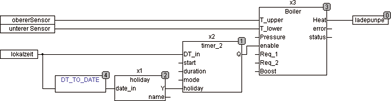

<!--
  Copyright (c) 2026 Hans Mühlbauer, Franz Höpfinger and others.

  This program and the accompanying materials are made available under the
  terms of the Eclipse Public License 2.0 which is available at
  https://www.eclipse.org/legal/epl-2.0

  SPDX-License-Identifier: EPL-2.0
-->

## BOILER

| | | |
|:---|:---|:---|
| **Type** | Function module | |
| **Input	T_UPPER** | REAL (input upper temperature sensor) | |
| **T_LOWER** | REAL (lower input temperature sensor) | |
| **PRESSURE** | REAL (input pressure sensor) | |
| **ENABLE** | BOOL (hot water requirement) | |
| **REQ_1** | BOOL (input requirements for predefined | Temperature 1) |
| **REQ_2** | BOOL (input requirements for predefined | Temperature 2) |
| **BOOST** | BOOL (input requirement for immediate | |
| | Deployment) | |
| **Output	HEAT** | BOOL (output loading circuit) | |
| **ERROR** | BOOL (error signal) | |
| **STATUS** | Byte (ESR compliant status output) | |
| **Setup	T_UPPER_MIN** | REAL (minimum temperature at top) | |
| | Default = 50 | |
| **T_UPPER_MAX** | REAL (maximum temperature at top) | |
| | Default = 60 | |
| **T_LOWER_ENABLE** | BOOL (FALSE, if lower | Temperature Sensor  does not exist) |
| **T_LOWER_MAX** | REAL (maximum temperature of bottom) | |
| | Default = 60 | |
| **T_REQUEST_1** | REAL (temperature requirement 1) | |
| | Default = 70 | |
| **T_REQUEST_2** | REAL (temperature requirement 2) | |
| | Default = 50 | |
| **T_REQUEST_HYS** | REAL (hysteresis control) Default = 5 | |
| **T_PROTECT_HIGH** | REAL (upper limit temperature, | |
| | Default = 80) | |
| **T_PROTECT_LOW** | REAL (lower limit temperature, | |
| | Default = 10) | |
| | BOILER is a Controllerfor buffers such as warm water buffer. With two separate temperature sensor inputs also storage layers can be controlled. With the setup variable  T_LOWER_ENABLE the lower temperature sensor can be switched on and off. When the input ENABLE = TRUE, the boiler is heated (HEAT = TRUE) until the preset temperature T_LOWER_MAX reaches the lower area of the buffer and then turn off the heater, until the lower limit temperature of the upper region (T_UPPER_MIN) is reached. If T_LOWER_ENABLE is set to FALSE, the lower sensor is not evaluated and it control the temperature between T_UPPER_MIN and T_UPPER_MAX at the top. A PRESSURE-input protects the boiler and prevents the heating, if not enough water pressure in the boiler is present. If a pressure sensor is not present, the input is unconnected. As further protection are the default values T_PROTECT_LOW (antifreeze) and T_PROTECT_HIGH are available and prevent the temperature in the buffer to not exceed an upper limit and also a lower limit. If an error occurs, the output ERROR is set to TRUE, while a status byte is reported at output STATUS, which can be further evaluated by modules such as ESR_COLLECT. By a rising edge at input BOOST the buffer temperature is directly heated to T_UPPER_MAX (T_LOWER_ENABLE = FALSE) or T_LOWER_MAX (T_LOWER_ENABLE = TRUE). BOOST can be used to impairment heating up the boiler when ENABLE is set to FALSE. The heating by BOOST is edge-triggered and leads during each rising edge at BOOST to exactly one heating process. Due to a rising edge on BOOST while ENABLE = TRUE the heating is started immediately until the maximum temperature is reached. The boiler will be loaded to provide maximum heat capacity. The inputs REQ_1 and REQ_2 serve any time to provide a preset temperature (or T_REQUEST_1 T_REQUEST_2). REQ can be used for example to provide a higher temperature for legionella disinfection or for other purposes. The provision of the request temperatures is made by measuring at the upper temperature sensor and  with a 2-point control whose hysteresis is set by T_REQUEST_HYS. | |
| **The following Example shows the application of a BOILER  with a TIMER and a public holiday mode** |  | |

| Status |  |
| --- | --- |
| 1 | upper temperature sensor has exceeded the upper limit temperature |
| 2 | upper temperature sensor has fallen below the lower limit temperature |
| 3 | lower temperature sensor has exceeded the upper limit temperature |
| 4 | lower temperature sensor has fallen below the lower limit temperature |
| 5 | Water pressure in the buffer is too small |
| 100 | Standby |
| 101 | BOOST recharge |
| 102 | Standard recharge |
| 103 | Recharge on Request Temperature 1 |
| 104 | Recharge on Request Temperature 2 |
