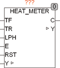

<!--
  Copyright (c) 2026 Hans Mühlbauer, Franz Höpfinger and others.

  This program and the accompanying materials are made available under the
  terms of the Eclipse Public License 2.0 which is available at
  https://www.eclipse.org/legal/epl-2.0

  SPDX-License-Identifier: EPL-2.0
-->

## HEAT_METER

| | |
|:---|:---|
| **Type	 Function** | REAL |
| **Input	TF** | REAL (flow temperature in °C) |
| **TR** | REAL (back flow temperature in °C) |
| **LPH** | REAL (Flow in L/h or L/pulse) |
| **E** | BOOL (  Enable  Signal) |
| **RST** | BOOL (asynchronous reset input) |
| **Output	C** | REAL (current consumption in joules/hour) |
| **I / O	Y** | REAL (amount of heat in joules) |
| | HEAT_METER is a calorimeter. The amount of heat Y is measured in joules. The inputs of TF and TR are the forward and return temperature of the medium. At the input LPH the flow rate in liters/hour, resp. the flow rate per pulse of E is specified. The property of E is determined by the  Setup  Variable PULSE_MODE. PULSE_MODE = FALSE means   the amount of heat is added continuously as long as E is set to TRUE. PULSE_MODE = TRUE means the amount of heat with each rising edge of E is added up. The PULSE_MODE is turned on the use of heat meters, while indicating the flow rate in liters per pulse at the input LPH and  the heat meter is connected at the input E. If no flow meter is present, the  the pump signal is connected at input E and at the input LPH given the pump capacity in liters per hour. When using a flow meter with analog output is the output to be converted to liters per hour and sent to the input LPH, the input E will be set to TRUE. With the setup variables CP, DENSITY and CONTENT the 2nd component of the medium is specified. For operation with pure water no details of CP, DENSITY and CONTENT are necessary. [fzy] If a mixture of water and a 2nd media is present, with CP the specific heat capacity in J/KgK, with DENSITY the density in KG/l and with CONTENT the portion of the 2nd component is specified. A proportion of 0.5 means 50% and 1 would be equivalent to 100%. The setup variables RETURN_METER is specified whether the flow meter sits in forward or reverse. RETRUN_METER = TRUE for return measurement and FALSE for flow measurement. The output C of the module represents the current consumption. The current consumption is measured in joules/hour, and is determined at the intervals of AVG_TIME. |
| **The module has the following default values that are active when the corresponding values are not set by the user** |  |
| | PULSE_MODE = FALSE |
| | RETURN_METER = FALSE |
| | AVG_TIME = T#5s |
| **Setup	CP** | REAL (Specific heat capacity   2nd component) |
| **DENSITY** | REAL (density of the 2nd component) |
| **CONTENT** | REAL (share, 1 = 100%) |
| **PULSE_MODE** | BOOL (pulse counter if TRUE) |
| **RETURN_METER** | BOOL (flow meter in the return |
| | if TRUE) |
| **AVG_TIME** | TIME (time interval for current consumption) |

