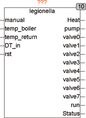
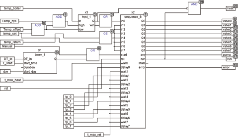
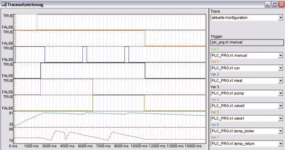

<!--
  Copyright (c) 2026 Hans Mühlbauer, Franz Höpfinger and others.

  This program and the accompanying materials are made available under the
  terms of the Eclipse Public License 2.0 which is available at
  https://www.eclipse.org/legal/epl-2.0

  SPDX-License-Identifier: EPL-2.0
-->

## LEGIONELLA

| | |
|:---|:---|
| **Type** | Function module |
| **Input	MANUAL** | BOOL (Manual Start Input) |
| **TEMP_BOILER** | REAL (boiler temperature) |
| **TEMP_RETURN** | REAL (temperature of the circulation pipe) |
| **DT_IN** | DATE_TIME (Current time of day and date) |
| **RST** | BOOL (Asynchronous Reset) |
| **Output	HEAT** | BOOL (control signal for hot water heating) |
| **PUMP** | BOOL (control signal for circulation pump) |
| **STATUS** | Byte (ESR compliant status output) |
| **Valve0..7** | BOOL (control outputs for valves of circulation) |
| **RUN** | bool (true if sequence is running) |
| **Setup	T_START** | TOD (time of day at which the disinfection starts) |
| **DAY** | INT (weekday on which the disinfection starts) |
| **TEMP_SET** | REAL (temperature of the boiler) |
| **TEMP_OFFSET** | REAL () |
| **TEMP_HYS** | REAL () |
| **T_MAX_HEAT** | TIME (maximum time to heat up the boiler) |
| **T_MAX_RETURN** | TIME (maximum time until the input |
| | TEMP_RETURN to be active after VALVE) |
| **TP_0 .. 7** | TIME (disinfection time for circles 0..7). |
| | LEGIONELLA has an integrated timer, which starts on a certain day (DAY) to a specific time of day (T_START) the desinfection. For this purpose, the external interface of the local time is needed (DT_IN). Each time can be started the desinfection by hand with a rising edge at MANUAL. |
| | The process of a disinfection cycle is started with an internal start due to DT_IN, DAY and T_START, or by a rising edge at MANUAL.   The output HEAT is TRUE and controls the heating of the boiler. Within the heating time T_MAX_HEAT the input signal TEMP_BOILER must go then to TRUE. If the temperature is not reported within T_MAX_HEAT, the output STATUS passes fault. The disinfection then continues anyway. After the heating, the heater temperature is measured and reheated if necessary by TRUE at the output HEAT. When the boiler temperature is reached, PUMP gets TRUE and the circulation pump is turned on. Then the individual valves are opened one after the other and measured, whether within the time T_MAX_RETURN the temperature war reached at the return of the circulation line. If a return flow thermometer is not present, the input T_MAX_RETURN remains open. |
| **The output STATE is compatible with ESR, and may give the following messages** |  |
| **110** | On hold  111	Sequence run |
| **1** | Boiler temperature was not reached |
| **2** | Return temperature at Ventil0 was not reached |
| **3..8** | Return temperature at valve1..7 was not reached |
| **Schematic internal structure of Legionella** |  |
| **The following  example  shows a simulation for 2 disinfection circuits with trace recording. In this structure, VALVE2 connected to the input RST and thus disrupts the sequence after of two circles** |  |

