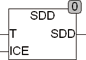

<!--
  Copyright (c) 2026 Hans Mühlbauer, Franz Höpfinger and others.

  This program and the accompanying materials are made available under the
  terms of the Eclipse Public License 2.0 which is available at
  https://www.eclipse.org/legal/epl-2.0

  SPDX-License-Identifier: EPL-2.0
-->

## SDD

| | |
|:---|:---|
| **Type	 Function** | REAL |
| **Input	T** | REAL (air temperature in ° C) |
| **ICE** | BOOL (TRUE for air over ice and FALSE for air over |
| | water) |
| **Output** | REAL (saturation vapor pressure in Pa) |
| | SDD calculates the saturation vapor pressure for water vapor in air. The temperature T is given in Celsius. The result can be calculated for air over ice (ICE = TRUE) and for air to water (ICE = FALSE). The scope of the function is -30°C to 70°C over water and at -60°C to 0°C on ice. The calculation is performed according to the Magnus formula. |

