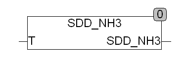

<!--
  Copyright (c) 2026 Hans Mühlbauer, Franz Höpfinger and others.

  This program and the accompanying materials are made available under the
  terms of the Eclipse Public License 2.0 which is available at
  https://www.eclipse.org/legal/epl-2.0

  SPDX-License-Identifier: EPL-2.0
-->

## SDD_NH3

| | |
|:---|:---|
| **Type	 Function** | REAL |
| **Input	T** | REAL (temperature in °C) |
| **Output** | REAL (saturation vapor pressure in Pa) |
| | SDD_NH3 calculates the saturation vapor pressure for ammonia (NH3). The temperature T is given in Celsius. The scope of the function is located at -109°C to 98°C. |

