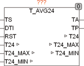

<!--
  Copyright (c) 2026 Hans Mühlbauer, Franz Höpfinger and others.

  This program and the accompanying materials are made available under the
  terms of the Eclipse Public License 2.0 which is available at
  https://www.eclipse.org/legal/epl-2.0

  SPDX-License-Identifier: EPL-2.0
-->

## Type	Function module

| | |
|:---|:---|
| **Input	TS** | INT (external temperature sensor) |
| **DTI** | DT (Date and time of day) |
| **RST** | BOOL (Reset) |
| **Output	TA** | REAL (Current outside temperature) |
| **TP** | BOOL (TRUE if T24 is renewed) |
| **I / O	T24** | REAL (daily average temperature) |
| **T24_MAX** | REAL (Maximaltemp. in the last 24 hours) |
| **T24_MIN** | REAL (minimum temperature in the last 24 hours) |
| | T_AVG24 determines the daily average temperature T24. The sensor input TS is of type INT and is the temperature * 10 (a value of 234 means 23.4 °C). The data of filter run for noise suppression on a low-pass filter with time T_FILTER. By scale and SFO a zero error, and the scale of the sensor can be adjusted. At output TA shows the current outside temperature, which is measured every hour and half hour. The module writes every 30 minutes the last, over the 48 values calculated daily average in the I / O variable T24. This needs to be defined externally and thereby can be definded remanent  or persistent. If the first start a value of -1000 found in T24, then the module initializes at the first call with the current sensor value, so that every 30 minutes a valid average may be passed. If T24 has any value other than -1000, then the module is initialized with this value and calculates the average based on this value. This allows a power failure and remanent storage of T24 an immediate working after restart. A reset input can always force a restart of the module, which depending on the value in T24, the module is initializes with either TS or the old value of T24. If the module should be set on a particular average, the desired value is written into T24 and then a reset generated. |
| | T24_MAX and T24_MIN passes the maximum and minimum values of the last 24 hours. To determine the maximum and minimum value, the temperatures of each half hour are  considered. A temperature value that occurs between 2 measurements is not considered. |
| **Setup	T_FILTER** | TIME (T of the input filter) |
| **SCALE** | REAL:= 1.0 (scaling factor) |
| **SFO** | REAL (zero balance) |

