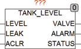

<!--
  Copyright (c) 2026 Hans Mühlbauer, Franz Höpfinger and others.

  This program and the accompanying materials are made available under the
  terms of the Eclipse Public License 2.0 which is available at
  https://www.eclipse.org/legal/epl-2.0

  SPDX-License-Identifier: EPL-2.0
-->

## TANK_LEVEL

| | |
|:---|:---|
| **Type** | Function module |
| **Input	LEVEL** | BOOL (input for level sensor) |
| **LEAK** | BOOL (input for leak sensors) |
| **ACLR** | BOOL (input to reset the alarm) |
| **Output	VALVE** | BOOL (output signal to valve) |
| **ALARM** | BOOL (alarm output) |
| **STATUS** | BYTE (ESR compliant status output) |
| | TANK_LEVEL used to keep the level of liquid in a tank constant. At the input LEVEL a niveau sensor is connected and at the output VALVE, the after feed valve is connected. To debounce at the troubled fill niveau the level sensor, its response time can be adjusted using the Setup variable LEVEL_DELAY_TIME. At the input LEVEL with TRUE is displayed, that the liquid level is too low. After the input was through for the time LEVEL_DELAY_TIME to TRUE, the output VALVE set to TRUE to replenish fluid. During the replenishment process MAX_VALVE_TIME is monitored, and if VALVE stay longer than this time to TRUE, an alarm is generated in the case of sensor failures or leaks to prevent a permanent refill. The module also monitors the input LEAK which for normal operation must always be FALSE. Once LEAK goes to TRUE the refill immediately stops and a alarm is generated. LEAK is used to connect leak sensors and or additional niveau sensors above the normal levels. If f an alarm occurs in the operation the module will stop any refill until the error has been fixed and the input ACLR is set to TRUE shortly. At the ESR status output all operating conditions are passed with ESR messages. |
| | STATUS = 1, leak sensor (LEAK) is enabled. |
| | STATUS = 2, refill time (MAX_VALVE_TIME) was exceeded. |
| | STATUS = 100, level is reached, feeding off. |
| | STATUS = 101, ACLR was pressed. |
| | STATUS = 102, level below, make-up runs. |
| **Setup** | MAX_VALVE_TIME (Maximum make-up time for valve) |
| **LEVEL_DELAY_TIME** | TIME (response time for input LEVEL) |

