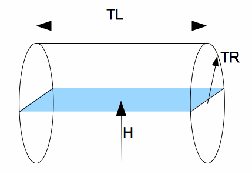

<!--
  Copyright (c) 2026 Hans Mühlbauer, Franz Höpfinger and others.

  This program and the accompanying materials are made available under the
  terms of the Eclipse Public License 2.0 which is available at
  https://www.eclipse.org/legal/epl-2.0

  SPDX-License-Identifier: EPL-2.0
-->

## TANK_VOL1

| | | |
|:---|:---|:---|
| **Type	Function** | REAL | |
| **Input	 TR** | REAL | (Radius of the tank) |
| **TL** | REAL | (Length of the tank) |
| **H** | REAL | (Filling height of the tank) |
| **Output** | Real	(Contents of the tank to the fill level) | |
| | TANK_VOL1 calculates the contents of a tube-shaped tanks filled to the height H. | |

