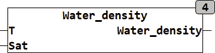

<!--
  Copyright (c) 2026 Hans Mühlbauer, Franz Höpfinger and others.

  This program and the accompanying materials are made available under the
  terms of the Eclipse Public License 2.0 which is available at
  https://www.eclipse.org/legal/epl-2.0

  SPDX-License-Identifier: EPL-2.0
-->

## Type	 Function  : REAL

| | |
|:---|:---|
| **Input	T** | REAL (temperature of the water) |
| **SAT** | BOOL (TRUE, if the water is saturated with air) |
| **Output** | REAL (water density in grams / liter) |
| | WATER_DENSITIY calculates the density of liquid water as a function of temperature at atmospheric pressure. The temperature T is given in Celsius. The highest density reached water at 3.983 °C with 999.974950 grams per liter. WATER_DENSITY calculates the density of liquid water, not frozen or evaporated water. WATER_DENSITY calculates the density of air-free water when SAT = FALSE, and air-saturated water when SAT = TRUE. The calculated values are calculated using an approximate formula and results values with an accuracy greater than 0.01% in the temperature range of 0 - 100°C at a constant pressure of 1013 mBar. |
| | The deviation of the density of air saturated with water is corrected according to the formula of Bignell. |
| | The dependence of the density of water pressure is relatively low at about 0.046 kg/m³ per 1 bar pressure increase, in the range up to 50 bar. The low pressure dependence has practical applications, no significant influence. |

