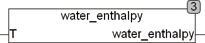

<!--
  Copyright (c) 2026 Hans Mühlbauer, Franz Höpfinger and others.

  This program and the accompanying materials are made available under the
  terms of the Eclipse Public License 2.0 which is available at
  https://www.eclipse.org/legal/epl-2.0

  SPDX-License-Identifier: EPL-2.0
-->

## Type	 Function  : REAL

| | |
|:---|:---|
| **Input	T** | REAL (temperature of the water) |
| **Output** | REAL (enthalpy of water in J/g at temperature T) |
| | WATER_ENTHALPY calculates the  Enthalpy  (Heat content) of liquid water as a function of temperature at atmospheric pressure. The temperature T is given in Celsius. The calculation is valid for a temperature of 0 to 100 ° C and the result is the amount of heat needed to head the water from 0 ° C to a temperature of T. The result is expressed in joules / gram J / g and passed as KJ/Kg. It is calculated by linear interpolation in steps of 10 ° and thus reach a sufficient accuracy for non-scientific applications. A possible   Application of WATER_ENTHALPY is to calculate the amount of energy needed, for example, to head a buffer tank at X (T2 - T1) degree. From the energy required then the runtime of a boiler can be calculated exactly and the required energy can be provided. Since there temperature readings are significantly delays,  with this method a better heating is possible in practice. |

