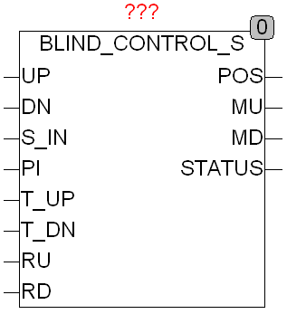
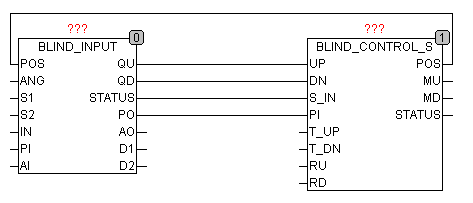

<!--
  Copyright (c) 2026 Hans Mühlbauer, Franz Höpfinger and others.

  This program and the accompanying materials are made available under the
  terms of the Eclipse Public License 2.0 which is available at
  https://www.eclipse.org/legal/epl-2.0

  SPDX-License-Identifier: EPL-2.0
-->

## BLIND_CONTROL_S

| | |
|:---|:---|
| **Type** | Function module |
| **Input	UP** | BOOL (Input UP) |
| **DN** | BOOL (input DOWN) |
| **S_IN** | BYTE (ESR compliant status input) |
| **PI** | BYTE (default of position) |
| **T_UP** | TIME (duration of the blinds upwards) |
| **T_DN** | TIME (Duration of the blinds downwards) |
| **RU** | BOOL (release up) |
| **RD** | BOOL (release down) |
| **Output	POS** | BYTE (Simulated position) |
| **MU** | BOOL (motor up signal) |
| **MD** | BOOL (Motor down Signal) |
| **STATUS** | BYTE (ESR compliant status output) |
| | BLIND_CONTROL_S manages and controls the position of blinds. The outputs MU and MD control the up and down direction of the motors. The time T_LOCKOUT is the waiting time for a change of direction between MU and MD and the times T_UP and T_DN determine how long the engine need for a full movement downwards or upwards. As the run time of the engine can vary, on reaching a final position  (Above or below) the corresponding motor is in addition to the time T_EXT controlled to ensure that the final position is attained, which provides a continuous calibration of the system. For the first start and after a power failure, a calibration run is done automatically upwards. The variable EXT_TRIG indicates from what distance from the final value the run time will be extended. In automatic mode the setting R_POS_TOP limits the maximum position of the blinds if RD = TRUE. For example the blind remain at 240 if RD = TRUE and R_POS_TOP = 240, which may prevent freezing in winter in the up position. Similarly, R_POS_BOT and RU = TRUE are for the lowest possible position in charge, which can place during the summer for forced ventilation. The output of POS is the simulated position of the blinds, 0 = down and 255 = up. S_IN and STATUS are the ESR compatible status inputs and outputs. |
| **The module is interconnected with other components of the shutter control** |  |
| | BLIND_CONTROL_S is specially designed for the control of blinds and has in contrast to shutters no angle, so the device also has no input AI and no output ANG. BLIND_CONTROL_S can be connected of course with the other BLIND components of the library. |
| | The module supports automatic calibration, which can cause, after a power failure, to move up all blinds, which is undesired some times in your absence.  Therefore, in case of your absence the desired position of the blinds should be given to the input PI. The blinds move to up position for calibration, and then automatically move into the desired position. The automatic calibration   however can be prevented if both inputs UP and DN are FALSE. |
| **Setup	T_LOCKOUT** | TIME (lockout time at direction reverse of motors) |
| **T_EXT** | TIME (extension time to stop) |
| **EXT_TRIG** | BYTE (  Trigger  for extension time) |
| **R_POS_TOP** | BYTE (Maximum position when RD = TRUE) |
| **R_POS_BOT** | BYTE (minimum position if RU = TRUE) |

| UP | DN | STATUS |  | MU | MD |
| --- | --- | --- | --- | --- | --- |
| H | H | 103 | POS is regulated to PI | auto | auto |
| L | H | 102 | Manual operation down | L | H |
| H | L | 101 | Manual mode up | H | L |
| L | L | - | Manual  Timeout | L | L |
| - | - | 107 | Lockout  Time | L | L |
| - | - | 108 | Auto calibration | H | L |
| - | - | 109 | Time extension | X | X |
