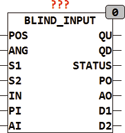
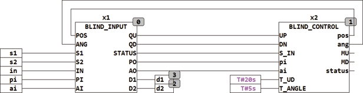

<!--
  Copyright (c) 2026 Hans Mühlbauer, Franz Höpfinger and others.

  This program and the accompanying materials are made available under the
  terms of the Eclipse Public License 2.0 which is available at
  https://www.eclipse.org/legal/epl-2.0

  SPDX-License-Identifier: EPL-2.0
-->

## Type	Function module

| | |
|:---|:---|
| **Input	POS** | BYTE (return of the blind position) |
| **ANG** | BYTE (return of the slat angle) |
| **S1** | BOOL (Input UP) |
| **S2** | BOOL (input DOWN) |
| **IN** | BOOL (Controlled operations if TRUE) |
| **PI** | BYTE (position if IN = TRUE) |
| **AI** | BYTE (angle   if IN = TRUE) |
| **Output	QU** | BOOL (motor up signal) |
| **QD** | BOOL (motor down signal) |
| **STATUS** | BYTE (ESR compliant status output) |
| **PO** | BYTE (output position) |
| **AO** | BYTE (output angular position) |
| **D1** | BOOL (command output for double click function 1) |
| **D2** | BOOL (command output for double click function 2) |
| | BLIND_INPUT serves as a key interface for operating blinds. The module supports three modes, manual, automatic and controlled operation. if IN = FALSE (manual mode), the inputs S1 and S2 are used to control the outputs of QU and QD. If the  Setup  Variable SINGLE_SWITCH = TRUE, then the input S2 is ignored and the entire control is on the S1 switch. S1 will switch alternately QU and QD so as followed by pressing the button S1 change between up and down motion in succession. The internal default is FALSE (2 button configuration). The setup variable MANUAL_TIMEOUT defined rest period after which (time with no signal at S1 or S2), the device automatically switches to automatic mode. If this value is not specified then the internal default value of 1 hour   used. When the input IN = TRUE, the outputs of QU and QD goes to automatic (both are set TRUE), and switched the inputs PI and AI to the outputs PO and AO. IN can be pulsed to take on the values in short, the module controls these values for the time MAX_RUNTIME and then switches back to automatic mode. As long as IN = TRUE the automatic mode is pushed to the values of AI and PI. The inputs POS and  ANG are the return receipts for the current position of the shutter. These values are provided by the module BLIND_CONTROL. With the variable SETUP CLICK_MODE a click operation is set, a short press starts on the direction up for S1 and down for S2 and a second short press stops the appropriate direction or reverses the direction. This setting make sense for blinds with a long run time, or to move with a button press to one end. if the key is pressed longer as the setup time  CLICK_TIME so the CLICK mode will be leaved and the shutter moves as long as the button is held down in manual mode. If a key press is shorter than CLICK_TIME, the blinds moves further until a further click stops the drive or a final position is achieved. The default value is 500 milliseconds for CLICK_TIME and the default for CLICK_MODE is TRUE. If both variables CLICK_MODE Setup and SINGLE_SWITCH are TRUE at the same time, a button operation with only one button on S1 is possible. With the time set of MAX_RUNTIME the run time is limited, which ist started by a simple one  Click  started but not terminated with another  Click . The value of MAX_  RUNTIME  defaults to T#60s and should be as long as the blind safely reach the end position from any position. Two outputs D1 and D2 can be used to evaluate a double-click on S1 or S2, if D?_Toggle = TRUE a double-clicking switch an appropriate output and a further double-click again off, if D?_Toggle = FALSE so with each double-click a pulse is generated at the corresponding output. |
| | After a manual operation command is the module is for the time MANUAL_TIMEOUT in the mode "Manual Standby" (STATUS = 131), the manually hit position is maintained so well for this time and the automatic functions of all downstream components are suppressed. By a long (longer than CLICK_TIME) pressure on both buttons, the "Manual standby" mode is terminated prematurely and returned to automatic mode. |
| **The following table shows the operating states of the module** |  |
| | The output of STATUS is compatible and ESR are status messages about state changes. |
| **The following example shows the structure of a blind controller with the module BLIND_INPUT and BLIND_CONTROL** |  |
| | The use of other BLIND modules is optional and is used to extend the functionality. BLIND_INPUT and BLIND_CONTROL gives a full blind control. |
| | BLIND_INPUT can decode a double click at the two inputs S1 and S2   and turn the two outputs D1 and D2. These outputs can be used downstream function blocks or to control any other event. |
| **Master Mode** |  |
| | With the variable MASTER_MODE = TRUE, the master mode is turned on. The master mode prevents that the angle ANG and position POS  will be transfered to the outputs AO and PO in  Standby Mode 130. Blind modules which are between the input and  Control  modules can switch the position of the shutter and the shutter remains after the change in the new position (if MASTER_MODE = FALSE). However, if the variable MASTER_MODE = TRUE ensures that after an automatic stop by downstream modules the Blind Input resets again to the old position. If MASTER_MODE = FALSE in the state 130 the POS and ANG is transmitted in on the outputs of PO and AO. Is MASTER_MODE = TRUE the last valid value remains at the STATUS 130 on the outputs PO and AO and the inputs of POS and ANG are not transferred. The module BLIND_INPUT thus retains the last valid BLIND_INPUT position. |
| **Setup	SINGLE_SWITCH** | BOOL (TRUE for single button operation) |
| **CLICK_EN** | BOOL (  TRUE for single-click mode  ) |
| **CLICK_TIME** | TIME (  Timeout  for K  lick  Detection) |
| **MAX_RUNTIME** | TIME (  Timeout  for one movement) |
| **MANUAL_TIMEOUT** | TIME (  Timeout  of manual operation) |
| **DEBOUNCE_TIME** | TIME (debounce time for the inputs S) |
| **DBL_CLK1** | BOOL (move to double click position if TRUE) |
| **DBL_POS1** | BYTE (position at S1 double-click) |
| **DBL_ANG1** | BYTE (angle at S1 double-click) |
| **DBL_CLK2 away** | BOOL (move to double click position if TRUE) |
| **DBL_POS2** | BYTE: = 255 (position at S2 double click) |
| **DBL_ANG2** | BYTE: = 255 (angle at S2 double click) |
| **D1_TOGGLE** | BOOL: = TRUE (Toggle mode for D1) |
| **D2_TOGGLE** | BOOL: = TRUE (Toggle mode for D2) |
| **MASTER_MODE** | BOOL (enable the master mode if TRUE) |

| POSANG | S1 | S2 | IN | PIAI | QU | QD | POAO | D1 | D2 |  |
| --- | --- | --- | --- | --- | --- | --- | --- | --- | --- | --- |
| X | L | L | L | - | H | H | X * 5 | - | - | Standy / automatic operation |
| - | - | - | H | Y | H | H | Y | - | - | controlled operation, PI and AI are served |
| X | H | L | L | - | H | L | X | - | - | Manual mode up |
| X | L | H | L | - | L | H | X | - | - | Manual operation down |
| X | H | H | L | - | H | H | X | - | - | Manual Mode Exit prematurely |
| X | L | L | L | - | L | L | X | - | - | Manual operation standby until timeout expires |
| X | * 4 | L | L | - | H | L | X | - | - | CLICK_EN = TRUE |
| X | L | * 4 | L | - | L | H | X | - | - | CLICK_EN = TRUE |
| - | * 2 | L | L | - | H | H | - | / D1 | - | D1_TOGGLE = TRUE |
| - | * 2 | L | L | - | H | H | - | * 3 | - | D1_TOGGLE = FALSE |
| - | L | * 2 | L | - | H | H | - | - | / D2 | D2_TOGGLE = TRUE |
| - | L | * 2 | L | - | H | H | - | - | * 3 | D2_TOGGLE = FALSE |
| *1   in transition in the automatic mode, the outputs PO and AO are set to the last value of POS and AN.*2   Double click*3   Output pulse for one cycle*4   Single click, is blind moves in one direction for MAX_RUNTIME*5  angle and position are not transferred if the variable MASTER_MODE = TRUE. |

| STATUS | Meaning |
| --- | --- |
| 130 | Standby mode |
| 131 | Manual Standby |
| 132 | manually up |
| 133 | manually down |
| 134 | Single-clicking up |
| 135 | single-click down |
| 136 | IN = TRUE forces values |
| 137 | Double-clicking position 1 is hit |
| 138 | Double-click position 2 is hit |
| 139 | Force Automatic Mode |
