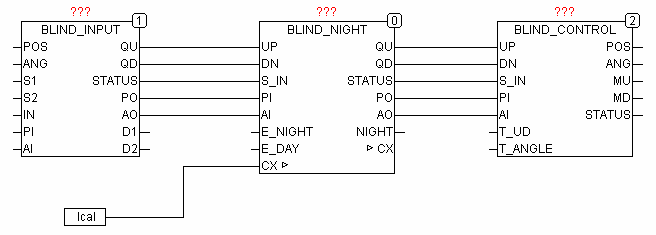
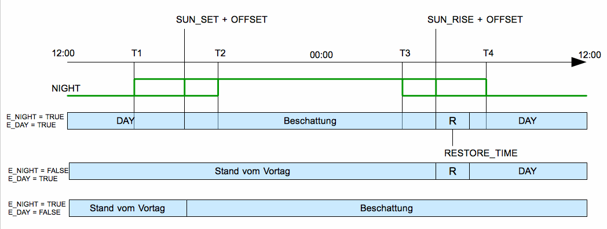

<!--
  Copyright (c) 2026 Hans Mühlbauer, Franz Höpfinger and others.

  This program and the accompanying materials are made available under the
  terms of the Eclipse Public License 2.0 which is available at
  https://www.eclipse.org/legal/epl-2.0

  SPDX-License-Identifier: EPL-2.0
-->

## BLIND_NIGHT

| | |
|:---|:---|
| **Type** | Function module |
| **Input	UP** | BOOL (Input UP) |
| **DN** | BOOL (input DOWN) |
| **S_IN** | BYTE (ESR compliant status input) |
| **PI** | BYTE (input value of the blind position in automatic mode) |
| **AI** | BYTE (input value of the blade angle in automatic mode) |
| **E_NIGHT** | BOOL (Automatic night service on) |
| **E_DAY** | BOOL (automatic day service onπ) |
| **Output	QU** | BOOL (motor up signal) |
| **QD** | BOOL (motor down signal) |
| **STATUS** | BYTE (ESR compliant status output) |
| **PO** | BYTE (output value of the blind in automatic mode) |
| **AO** | BYTE (output value of the blade angle in automatic mode) |
| **NIGHT** | BOOL (TRUE between sunset and sunrise) |
| | BLIND_NIGHT serves to close the shutters or blinds at night. The module automatically closes the blind after sunset with a delay of SUNSET_OFFSET and the blind goes up after sunrise with a delay of SUNRISE_OFFSET again. The opening and closing can be unlocked separately with E_NIGHT for close and E_DAY for open. If, for example E_NIGHT set to TRUE and E_DAY not, so in the evening at dusk the blinds shuts down, but it must be opened the next morning manually. If E_NIGHT and E_DAY are not connected so both set internally to TRUE. To identify the corresponding periods, the module requires an external data structure of type CALENDAR. UP, DN and S_IN the inputs from other BLIND  modules and are passed in the day mode to the outputs QU, QD and STATUS. The signals PI, AI and PO, AO pass the values for the position and angle of the blind to the following modules. In the night mode at the outputs of PO and AO the values for night mode are passed, any manual operation deletes the automatic night mode. If E_DAY = TRUE, at the end of the night the defined day mode with DAY_POSITION and DAY_ANGLE is restored. The time RESTORE_TIME is the maximum time to reach the day position. |
| | The input and output S_IN STATUS are ESR compliant outputs and inputs. In Input S_IN  the upstream functions report their status to the module, this status will be forwarded to the output of STATUS, and own status messages also issued on STATUS. |
| **The following graphic shows the interconnection with other modules of BLIND_NIGHT for blind control** |  |
| | BLIND_NIGHT Timing Diagram |
| | The timing diagram shows a course of a day. The times T1 and T2 define the allowed range for the beginning of the night shade, T3 and T4 define the appropriate area for the restoration of the day position. The day and night position is predetermined by the setup values DAY_POSITION, DAY_ANGLE, NIGHT_POSITION and NIGHT_ANGLE. Using two release inputs E_DAY and E_NIGHT, the night shade and the days position are unlocked separately. Thus, for example if E_NIGHT = FALSE and TRUE = E_DAY the module can be used in the morning to bring the blinds in the specified days position. |
| **IN/OUT	CX** | CALENDAR (data structure for local time) |
| **Setup	SUNRISE_OFFSET** | INT (offset from sunrise in minutes) |
| **SUNSET_OFFSET** | INT (offset by the sunset in minutes) |
| **T1** | TOD (earliest point in time for night-shade) |
| **T2** | TOD (the latest point in time for night-shade) |
| **T3** | TOD (earliest point in time for day position) |
| **T4** | TOD (latest point in time for day position) |
| **NIGHT_POSITION** | BYTE (position for night service) |
| **NIGHT_ANGLE** | BYTE (angle for night service) |
| **DAY_POSITION** | BYTE (position for day position) |
| **DAY_ANGLE** | BYTE (angle for day position) |
| **RESTORE_TIME** | TIME (time to hit the day position) |

| STATUS | Meaning |
| --- | --- |
| 0 | no message |
| 141 | Night mode |
| 142 | day position will be reached |
| NNN | forwarded messages |
