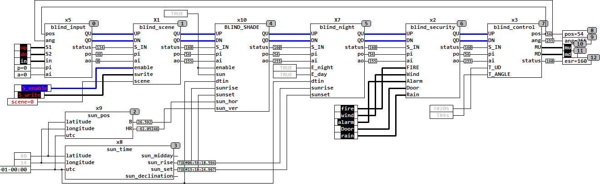

<!--
  Copyright (c) 2026 Hans Mühlbauer, Franz Höpfinger and others.

  This program and the accompanying materials are made available under the
  terms of the Eclipse Public License 2.0 which is available at
  https://www.eclipse.org/legal/epl-2.0

  SPDX-License-Identifier: EPL-2.0
-->

## Type	Function module

| | |
|:---|:---|
| **Input	UP** | BOOL (Input UP) |
| **DN** | BOOL (input DOWN) |
| **S_IN** | BYTE (ESR compliant status input) |
| **PI** | BYTE (input value of the blind position in automatic mode) |
| **AI** | BYTE (input value of the blade angle in automatic mode) |
| **ENABLE** | BOOL (enable input for scenes) |
| **SWRITE** | BOOL (write input scenes) |
| **SCENE** | BYTE (number of the scene) |
| **Output	QU** | BOOL (motor up signal) |
| **QD** | BOOL (motor down signal) |
| **STATUS** | BYTE (ESR compliant status output) |
| **PO** | BYTE (output value of the blind in automatic mode) |
| **[fuzzy] AO** | BYTE (output value of the blade angle in automatic mode) |
| | BLIND_SCENE stores up to 16 scenes consisting of relevant current blind position and angle, and can restore these scenes during retrieval. Every scene can be active or inactive, depending on whether saving the scene the input ENABLE was TRUE or not (ENABLE = TRUE means active). A scene is retrieved by the number of the scene (0 .. 15) is applied at the input SCENE and simultaneously ENABLE is set to TRUE. A scene can only be accessed if both the inputs UP and DN are the same TRUE (automatic mode). This ensures that an active scene always overridden by the manual mode of operation is. |
| **The following table illustrates the operation of BLIND_SCENE** |  |
| | The input S_IN and output STATUS are ESR compliant inputs and outputs, through input S_IN upstream modules report their status to the module, this status will be forwarded to the output of STATUS, and own status messages issued also on STATUS. |
| **The following graphic shows the application of BLIND_SCENE with other modules to control a blind** |  |

| UP | DN | ENABLE | SWRITE | SCENE | QU | QD | PO | AO |  |
| --- | --- | --- | --- | --- | --- | --- | --- | --- | --- |
| 1 | 1 | 0 | 0 | - | 1 | 1 | PI | AI | no scene |
| - | - | 1 | 1 | y | - | - | - | - | write scene number y |
| - | - | 0 | 1 | y | - | - | - | - | disable scene number y |
| 1 | 1 | 1 | 0 | y | 1 | 1 | - | - | recall scene number y |

| STATUS | Meaning |
| --- | --- |
| 160 .. 175 | scenes 0..15 active |
| 176 | Scene written |
| NNN | forwarded messages |
