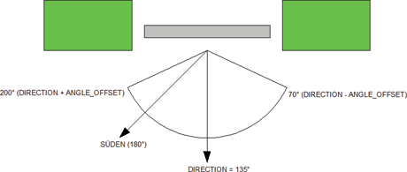
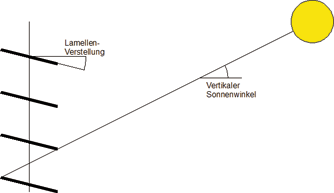

<!--
  Copyright (c) 2026 Hans Mühlbauer, Franz Höpfinger and others.

  This program and the accompanying materials are made available under the
  terms of the Eclipse Public License 2.0 which is available at
  https://www.eclipse.org/legal/epl-2.0

  SPDX-License-Identifier: EPL-2.0
-->

## Type	Function module

| | |
|:---|:---|
| **Input	UP** | BOOL (Input UP) |
| **DN** | BOOL (input DOWN) |
| **S_IN** | BYTE (ESR compliant status input) |
| **PI** | BYTE (blind position in automatic mode) |
| **AI** | BYTE (slat angle in automatic mode) |
| **SUN** | BOOL (input signal from the solar sensor) |
| **I / O	CX** | CALENDAR (current time and calendar data) |
| **Output	QU** | BOOL (motor up signal) |
| **QD** | BOOL (motor down signal) |
| **STATUS** | BYTE (ESR compliant status output) |
| **PO** | BYTE (blind position in automatic mode) |
| **AO** | BYTE (slat angle in automatic mode) |
| | BLIND_SHADE calculate the appropriate angle of the slats from the current position of the sun to guarantee an optimum shading. The slats are tracked to the sun, th ensure over the course of the day always shading. With the input ENABLE the function is activated when UP and DN (automatic mode) are active. The module evaluate the INPUT SUN, which displays sunshine when TRUE. If SUN or ENABLE gets FALSE then the device switches off automatically. SUNRISE_OFFSET define after which time lag after sunrise, the shading is active. SUNSET_PRESET determines a what time before sunset the shading is stopped. The shading is active  if SUN = TRUE, ENABLE = TRUE, UP = TRUE, DN = TRUE, and the horizontal sun angle is within the range DIRECTION -  ANGLE_OFFSET and DIRECTION + ANGLE_OFFSET, and the day time is within the area defined by SUNRISE, SUNRISE_OFFSET, SUNSET SUNSET_PRESET. DIRECTION specifies the orientation of the facade, 180° means façade is south, 90° in the east and 270° in the west. With the setup variable SHADE_DELAY is determined how long after SUN is FALSE the shading remains active. The default value is 60 seconds. SHADE_DELAY prevents the case of constantly running up and down while partial cloud cover the blind. When using BLIND_SHADE make sure that the cycle time for the module is smaller as T_ANGLE / 512 * SENS. SENS is here the SENS value of the BLIND_CONTROLLERS. If the cycle time is too large, the blind will start irregular driving. The setup variable BLIND_POS specifies how far the blind can drive down when shadowing. |
| **The following graphic describes the geometry of blind** |  |
| **The following chart shows an east to south-facing facade with DIRECTION = 135° and ANGLE_OFFSET = 65°** |  |
| | The shading function calculates the angle of slats so that the slats only close  as far as the sun is shaded, but still as much light as possible enters the room. With the values DIRECTION and ANGLE_OFFSET the horizontal angle of the sun which requires a shading is calculated. Depending on the thickness of the wall and the width of the window the ANGLE_OFFSET can be set so that unnecessary shading is avoided. By DIRECTION of the direction of the facade is specified. Using the dimensions of the slats, width and distance in millimeters (SLAT_WIDTH and SLAT_SPACING) the module calcuates  how far the slats should be tilted to avoid the sun. The target is to tilt the slats as far as absolutely necessary in order to guarantee optimal lighting conditions. To not influence the mood and light conditions at sunrise and sunset, an OFFSET of the sunrise and a PRESET before the sunset can be adjusted. With an offset of 30 minutes and a preset of 60 minutes, for example, the shading started 30 minutes after sunrise and already finished 60 minutes before sunset. The input SUN of the module is to connect a solar intensity sensor or any suitable sensor which interrupts the function if there is no solar radiation. |
| **The following graphic illustrates the shading** |  |
| | The input and output S_IN STATUS are ESR compliant outputs and inputs. In Input S_IN  the upstream functions report their status to the module, this status will be forwarded to the output of STATUS, and own status messages also issued on STATUS. BLIND_SHADE report on the output STATUS the STATUS  151 when the shade is active. |
| **The following example shows the application of BLIND_SHADE within a blind control** |  |
| **Setup	SUNRISE_OFFSET** | TIME (delay at sunrise) |
| **SUNSET_PRESET** | TIME (delay at sunset) |
| **DIRECTION** | REAL (facade orientation, 180 ° = south facade) |
| **ANGLE_OFFSET** | REAL (Horizontal Aperture |
| | Shading) |
| **SLAT_WIDTH** | REAL (width of the slats in mm) |
| **SLAT_SPACING** | REAL (distance of the slats in mm) |
| **SHADE_DELAY** | TIME (delay time of shading) |
| **SHADE_POS** | BYTE (position for shading) |

