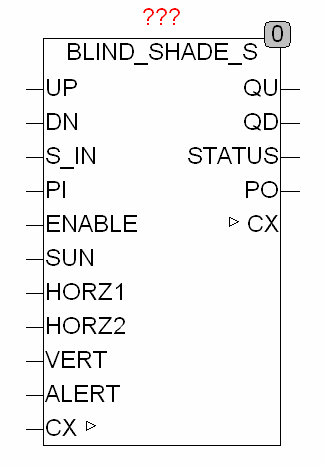
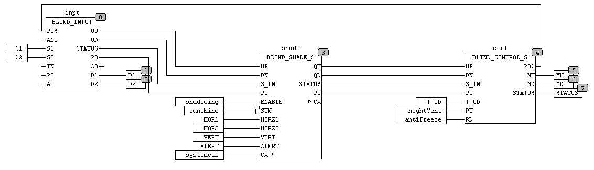

<!--
  Copyright (c) 2026 Hans Mühlbauer, Franz Höpfinger and others.

  This program and the accompanying materials are made available under the
  terms of the Eclipse Public License 2.0 which is available at
  https://www.eclipse.org/legal/epl-2.0

  SPDX-License-Identifier: EPL-2.0
-->

## Type	Function module

| | |
|:---|:---|
| **Input 	UP** | BOOL (Input UP) |
| **DN** | BOOL (input DOWN) |
| **S_IN** | BYTE (ESR compliant status input) |
| **PI** | BYTE (default of position) |
| **ENABLE** | BOOL (shading enabled) |
| **SUN** | BOOL (input signal from the solar sensor) |
| **HORZ1** | REAL (horizontal sun angle |
| | Shading start) [100.0] |
| **HORZ2** | REAL (horizontal sun angle |
| | Shading end) [260.0] |
| **VERT** | REAL (vertical shading angle) [90.0] |
| **ALERT** | BOOL (forced opening of the blinds) [FALSE] |
| **I / O	CX** | CALENDAR (current time and calendar data) |
| **Output	QU** | BOOL (motor up signal) |
| **QD** | BOOL (motor down signal) |
| **STATUS** | BYTE (ESR compliant status output) |
| **PO** | BYTE (blind position in automatic mode) |
| | BLIND_SHADE_S is a much simpler function of BLIND_SHADE specifically for use with roller blind. Here no slat angle for shading must be calculated, but simply ensure that when the sun shines the blind closes far enough. |
| | In the inactive state of the module the inputs UP, DN, and PI S_IN passed unchanged through to the outputs QU, QD, PO and STATUS. |
| | The module is activated, if UP = TRUE, DN = TRUE, ENABLE = TRUE and SUN (for at least SHADE_DELAY) = TRUE. If these conditions are met, the module checks whether the current horizontal sun angle is in the range between HORZ1 and HORZ2 and the vertical sun angle is lower than VERT. Is now also the current time between sunrise + SUNRISE_OFFSET and sunset - SUNSET_PRESET, then the module moves in the STATUS 151 (shading) and is ensuring that the value issued at output PO, not greater value than SHADE_POS (PO is then the minimum of PI and SHADE_POS). |
| **For the angle HORZ1 and HORZ2 is valid** | 90° = East, 180° = South, 270° = West. |
| | SHADE_DELAY prevents a permanent up and down move when partly cloud cover the blinds. |
| | With the input ALERT for example, can be achieved (in a simple manner) that the roller blind goes up when the door opens. The ALERT input has the highest priority in the module, forces STATUS = 152 independent of the inputs and sets QU = TRUE, FALSE = QD, drives therefore manually UP. |
| **Within a blind control the BLIND_SHADE are used as follows** |  |
| **Setup	SUNRISE_OFFSET** | TIME (Delay at sunrise) [T#1h] |
| **SUNSET_PRESET** | TIME (Delay at sunset) [T#1h] |
| **SHADE_DELAY** | TIME (Delay of shading) [T#60s] |
| **SHADE_POS** | BYTE (maximum position for shading) |

