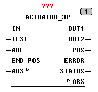

<!--
  Copyright (c) 2026 Hans Mühlbauer, Franz Höpfinger and others.

  This program and the accompanying materials are made available under the
  terms of the Eclipse Public License 2.0 which is available at
  https://www.eclipse.org/legal/epl-2.0

  SPDX-License-Identifier: EPL-2.0
-->

## ACTUATOR_3P

| | |
|:---|:---|
| **Type** | Function module |
| **Input	IN** | BYTE (input control signal 0 - 255) |
| **TEST** | BOOL (module processes diagnostics if TRUE) |
| **ARE** | BOOL (automatic diagnosis is allowed if TRUE) |
| **END_POS** | BOOL (input for limit switch) |
| **Output	OUT1** | BOOL (control signal for flap in the OPEN direction) |
| **OUT2** | BOOL (control signal for flap toward close) |
| **POS** | BYTE (simulated flap position) |
| **ERROR** | BOOL (TRUE if diagnostic errors) |
| **STATUS** | BYTE (ESR compliant status output) |
| **I / O	ARX** | BOOL (Auto-Communications) |
| **Setup	T_RUN** | TIME (run-time to full movement 0 - 255) |
| **T_EXT** | TIME (duration extension at diagnosis) |
| **T_CAL** | TIME (flaps up period for calibration) |
| **T_DIAG** | TIME (time for automatic diagnostics) |
| **SWITCH_AVAIL** | BOOL (TRUE, when limit switch |
| | is connected) |
| | ACTUATOR_3P is a 3-point actuator interface for controlling actuators with up / down input. The signal at the input IN is converted into pulses at the outputs OUT1 and OUT2 which drives the motor accordingly. The input signal IN is processed and the two control outputs (OUT1 and OUT2) are controlled so that an input value of 0 closes the flap, 255 opens the flap, and 127 half-open the flap. The module can also process a limit switch.  The limit switches must be connected so that no matter whether upper or lower end have been reached, the input END_POS gets TRUE, and thus indicating that the flap has reached one of the two end positions. To set the limit switch into operation, the setup variable SWITCH_AVAIL has to be TRUE, otherwise the limit switch is ignored. The diagnostic input TEST can start at any time a flap and engine diagnostics. The module then goes through a diagnostic cycle and report any errors at the output ERROR. A diagnostic cycle drives back the flap to 0%, then measures the running time from 0% - 100% and drives back to 0%. It also checks if the limit switches work properly (if it is activated by the setup variable  SWITCH_AVAIL ). After the diagnostic cycle, the valve moves back to its position defined by the input IN. The measured runtimes during the diagnostic are used in the operation to drive the flap very closely to each required position. With the setup variable T_DIAG is specified after which time a diagnosis independently is activated without going through the input Test. After power on automatically a diagnosis cycle runs. If the value T_DIAG = T#0s, an automatic diagnosis  is not performed. |
| | A flap is usually moved up and down to set different volume flows. The more a flap moves, the more it deviates from the ideal absolute position, because with every move a small position error and is added up over many movements. To prevent this error with the setup variables T_CAL after a defined period (The accumulated time of all flap movements), a calibration can be performed automatically. With this calibration the motor moves in the zero position and the flap is then returned to the value specified by IN. A value of T#0s for CAL_RUNTIME means that no automatic calibration is carried out. |
| | When calibration and diagnostics without limit for adding a full motion, the time T_EXT runtime T_RUN to ensure that reached its final position without the flap limit switch safely. |
| | At the output POS of the module, the current flap position is simulated by set the time T_RUN. At this output can also be determined, when the flap has reached the position requested the input. If the input TEST = TRUE, the device performs a diagnostic cycle. With the external variable ARX any modules communicate with each other and ensure for the self-diagnostic cycles (after power on) to do not run parallel. The user thereby determines how many and which modules are connected to the same variable and thus can be tuned. If a module is connected to an own variable ARX, no coordination of the diagnostic cycles is done. More information about the inputs TEST, ARE and ARX can be read at module Autorun. |
| **Status messages the module** |  |

| STATUS |  | ARE | ARX |
| --- | --- | --- | --- |
| 100 | Normal operation | - | - |
| 101 | Calibration | - | - |
| 103 | Diagnostic UP | TRUE | TRUE |
| 104 | Diagnostic UP | TRUE | TRUE |
