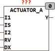

<!--
  Copyright (c) 2026 Hans Mühlbauer, Franz Höpfinger and others.

  This program and the accompanying materials are made available under the
  terms of the Eclipse Public License 2.0 which is available at
  https://www.eclipse.org/legal/epl-2.0

  SPDX-License-Identifier: EPL-2.0
-->

## Type	Function module

| | |
|:---|:---|
| **Input	I1** | BYTE (control signal 1) |
| **IS** | BOOL (input selection) |
| **I2** | BYTE (control signal 2) |
| **RV** | BOOL (reversal of direction for output Y) |
| **DX** | BOOL (self-activation) |
| **Output	Y** | WORD (control signal for the servo motor) |
| | ACTUATOR_A is used to control actuators with analog input. The module has two inputs (I1 and I2) that cover the range 0..255 the entire output range of Y. The output Y is of type WORD, and its operating range is predetermined by the setup values OUT_MIN and OUT_MAX. An input value of 0 produces the output value OUT_MIN and an input value of 255 creates the value OUT_MAX, different input values produce corresponding output values   between OUT_MIN and OUT_MAX. The module can be directly used to control DA converters with 16 bit input. The input IS selects between two inputs I1 and I2, thus can, for example, switch between manual and automatic operation. Another input DX switches when a rising edge immediately to self-activation. If SELF_ACT_TIME > t # 0s then the self-activation after the time SELF_ACT_TIME is repeated automatically, while the output Y is switched for the time RUNTIME to OUT_MIN, then for the same time on OUT_MAX and then returns back to the normal control value. The input RV can invert the output, Y = OUT_MAX if I = 0 and Y = OUT_MIN when I = 255. In this way, simply the direction of the servo motor to be reversed. |
| **Setup	RUNTIME** | TIME (runtime of the servo motor) |
| **SELF_ACT_TIME** | TIME (time for automatic movement) |
| **OUT_MIN** | DWORD (output value at I = 0) |
| **OUT_MAX** | DWORD (output value at I = 255) |

| IS | IS | IS | Y |
| --- | --- | --- | --- |
| 0 | 0 | 0 | Y = (OUT_MAX-OUT_MIN) * I1 /255 +OUT_MIN |
| 1 | 0 | 0 | Y = (OUT_MAX-OUT_MIN) * I2 /255 +OUT_MIN |
| 0 | 1 | 0 | Y = OUT_MAX - (OUT_MAX-OUT_MIN) * I1 /255 |
| 1 | 1 | 0 | Y = OUT_MAX - (OUT_MAX-OUT_MIN) * I2 /255 |
| - | - |  | starts a self activation cycle |
